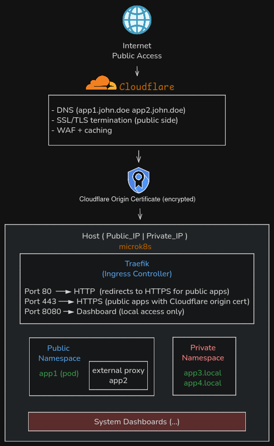

<i class="fas fa-server" aria-hidden="true"></i> MicroK8s Home Lab with Traefik Ingress

## Summary

This guide walks through setting up a complete MicroK8s cluster on Ubuntu with **Traefik** as the ingress controller. The architecture supports two types of applications: **public apps** exposed to the internet via Cloudflare DNS and TLS, and **private apps** accessible only from the local network. We'll deploy containerized workloads running inside Kubernetes pods, proxy traffic to external hosts, and set up monitoring dashboards—all managed through declarative YAML manifests.

Key features of this setup:
- **Traefik v3** as the ingress controller with native Kubernetes CRD support
- **Cloudflare integration** with origin certificates for secure public access
- **Namespace isolation** between public and private workloads
- **IP allowlist middleware** restricting public endpoints to Cloudflare IPs only
- **Keel** for automatic container image updates
- **Kubernetes Dashboard** for cluster monitoring

## Architecture Overview

<figure style="background: #252525; padding: 1.2rem; border-radius: 10px; display: inline-block;">
  <a href="img/microk8s_example.png" target="_blank" rel="noopener">
    
  </a>
  <figcaption style="color: #aaa; text-align: center; margin-top: 0.6rem; font-size: 0.97em;">
    MicroK8s Architecture: Public and Private Application Deployment (Click to expand)
  </figcaption>
</figure>

The architecture consists of:

1. **Internet traffic** flows through Cloudflare (DNS + proxy + TLS termination)
2. **Cloudflare** connects to the origin server using Cloudflare Origin Certificates
3. **Traefik** receives traffic on ports 80/443 and routes based on hostname
4. **Public Namespace** contains internet-facing applications
5. **Private Namespace** contains local-only applications
6. **External proxying** allows routing to services running on other hosts

### Traffic Flow Diagram

```
┌─────────────────────────────────────────────────────────────────────────────────┐
│                                  INTERNET                                       │
└─────────────────────────────────────────────────────────────────────────────────┘
                                       │
                                       ▼
┌─────────────────────────────────────────────────────────────────────────────────┐
│                               CLOUDFLARE                                        │
│  • DNS Records (app1.john.doe, app2.john.doe)                                   │
│  • SSL/TLS termination (public side)                                            │
│  • DDoS protection, WAF, caching                                                │
│  • Proxied mode (orange cloud) enabled                                          │
└─────────────────────────────────────────────────────────────────────────────────┘
                                       │
                    Cloudflare Origin Certificate (encrypted)
                                       │
                                       ▼
┌─────────────────────────────────────────────────────────────────────────────────┐
│                         HOST (PRIVATE_IP / PUBLIC_IP)                           │
│  ┌───────────────────────────────────────────────────────────────────────────┐  │
│  │                         TRAEFIK INGRESS                                   │  │
│  │                       (traefik-system namespace)                          │  │
│  │                                                                           │  │
│  │   hostPort 80  ──► HTTP  (redirect to HTTPS / private apps)               │  │
│  │   hostPort 443 ──► HTTPS (public apps with origin cert)                   │  │
│  │   hostPort 8080 ─► Dashboard (local access only)                          │  │
│  └───────────────────────────────────────────────────────────────────────────┘  │
│            │                      │                      │                      │
│  ┌─────────┴─────────┐  ┌─────────┴────────┐  ┌──────────┴────────┐             │
│  │  PUBLIC NAMESPACE │  │  PUBLIC NAMESPACE│  │ PRIVATE NAMESPACE │             │
│  │                   │  │                  │  │                   │             │
│  │  ┌─────────────┐  │  │  ┌────────────┐  │  │  ┌─────────────┐  │             │
│  │  │  app1 POD   │  │  │  │  app2      │  │  │  │ app3 POD    │  │             │
│  │  │  (internal) │  │  │  │  EXTERNAL  │  │  │  │ (local)     │  │             │
│  │  └─────────────┘  │  │  │  PROXY ────┼──┼──┼──► EXTERNAL_IP │  │             │
│  │                   │  │  └────────────┘  │  │  └─────────────┘  │             │
│  │                   │  │                  │  │  ┌─────────────┐  │             │
│  │                   │  │                  │  │  │ app4 POD    │  │             │
│  │                   │  │                  │  │  │ (local)     │  │             │
│  │                   │  │                  │  │  └─────────────┘  │             │
│  └───────────────────┘  └──────────────────┘  └───────────────────┘             │
│                                                                                 │
│  ┌───────────────────────────────────────────────────────────────────────────┐  │
│  │                    MONITORING & MANAGEMENT                                │  │
│  │   • Kubernetes Dashboard (hostPort 9443)                                  │  │
│  │   • Keel (hostPort 9300) - automatic image updates                        │  │
│  └───────────────────────────────────────────────────────────────────────────┘  │
└─────────────────────────────────────────────────────────────────────────────────┘
```

## Prerequisites

Before starting, ensure you have:

1. **Fresh Ubuntu server** (20.04 LTS or newer recommended)
2. **Domain name** with DNS managed by Cloudflare
3. **Network access** to ports 80/443 from the internet (for public apps)
4. **Cloudflare account** (free tier works)

### Hardware Requirements

| Resource | Minimum | Recommended |
|----------|---------|-------------|
| CPU | 2 cores | 4+ cores |
| RAM | 4 GB | 8+ GB |
| Storage | 20 GB | 50+ GB |

## Step 1: Install MicroK8s

MicroK8s is a lightweight, production-grade Kubernetes distribution from Canonical. It runs as a snap package on Ubuntu.

**Install MicroK8s:**

```bash
# Install MicroK8s
sudo snap install microk8s --classic

# Add current user to microk8s group (avoids sudo for kubectl)
sudo usermod -aG microk8s $USER

# Apply group changes
newgrp microk8s

# Verify installation
microk8s status --wait-ready
```

**Enable required addons:**

```bash
# DNS - Required for service discovery within the cluster
microk8s enable dns

# Storage - Required for PersistentVolumeClaims
microk8s enable hostpath-storage

# Metrics Server - Required for Kubernetes Dashboard resource metrics
microk8s enable metrics-server
```

<aside style="font-size:0.98em; color:#888; border-left:3px solid #6E8AA4; padding-left:1em; margin-bottom: 1.2em;">
  <strong>Note:</strong> Do NOT enable the built-in <code>traefik</code> addon from MicroK8s community repository. We'll deploy our own Traefik with custom configuration for more control.
</aside>

**Verify cluster is ready:**

```bash
# Check node status
microk8s kubectl get nodes

# Expected output:
# NAME            STATUS   ROLES    AGE   VERSION
# your-hostname   Ready    <none>   1m    v1.28.x
```

## Step 2: Prepare Cloudflare Origin Certificate

Cloudflare Origin Certificates encrypt traffic between Cloudflare and your origin server. They're free and valid for up to 15 years.

### Generate Origin Certificate

1. Log into [Cloudflare Dashboard](https://dash.cloudflare.com)
2. Select your domain
3. Navigate to **SSL/TLS → Origin Server**
4. Click **Create Certificate**
5. Configuration:
   - **Private key type**: RSA (2048)
   - **Hostnames**: `*.john.doe, john.doe` (wildcard + apex)
   - **Certificate Validity**: 15 years
6. Click **Create**
7. Save the certificate as `cert.pem`
8. Save the private key as `key.pem`

### Configure Cloudflare SSL Mode

1. Go to **SSL/TLS → Overview**
2. Set encryption mode to **Full (strict)**

| Mode | Description | Security |
|------|-------------|----------|
| Off | No encryption | ❌ Insecure |
| Flexible | HTTPS to Cloudflare, HTTP to origin | ⚠️ Partial |
| Full | HTTPS everywhere, any cert on origin | ⚠️ Medium |
| **Full (strict)** | HTTPS everywhere, valid/origin cert | ✅ Recommended |

### Configure DNS Records

For each public application, create an A record:

| Type | Name | Content | Proxy Status |
|------|------|---------|--------------|
| A | app1 | PUBLIC_IP | Proxied (orange cloud) |
| A | app2 | PUBLIC_IP | Proxied (orange cloud) |

<aside style="font-size:0.98em; color:#888; border-left:3px solid #6E8AA4; padding-left:1em; margin-bottom: 1.2em;">
  <strong>Important:</strong> The <strong>Proxied</strong> status (orange cloud) is essential. It routes traffic through Cloudflare's network, enabling SSL termination, DDoS protection, and the Cloudflare IP allowlist we'll configure later.
</aside>

## Step 3: Project Structure

Create the following directory structure for your Kubernetes manifests:

```bash
mkdir -p ~/my_k8s/{traefik,apps/public,apps/private,scripts}
cd ~/my_k8s
```

**Final structure:**

```
my_k8s/
├── cert.pem                    # Cloudflare origin certificate
├── key.pem                     # Cloudflare origin private key
├── deploy.sh                   # Main deployment script
├── get-dashboard-token.sh      # Helper for K8s dashboard login
├── 00-namespaces.yaml          # Namespace definitions
│
├── traefik/
│   ├── crds.yaml               # Traefik Custom Resource Definitions
│   ├── rbac.yaml               # ServiceAccount & RBAC permissions
│   ├── deployment.yaml         # Traefik Deployment & Service
│   └── cloudflare-ipallowlist.yaml  # Security middleware
│
├── apps/
│   ├── public/                 # Internet-facing applications
│   │   ├── app1.yaml           # App running in K8s pod
│   │   └── app2-external.yaml  # Proxy to external host
│   │
│   └── private/                # Local-only applications
│       ├── app3.yaml           # Private app 1
│       ├── app4.yaml           # Private app 2
│       ├── kubernetes-dashboard.yaml
│       └── keel.yaml           # Automatic image updates
│
└── scripts/
    └── update-cloudflare-ips.sh  # Update Cloudflare IP allowlist
```

## Step 4: Create Namespaces

Namespaces provide logical isolation between workloads. We use separate namespaces for public apps, private apps, and infrastructure components.

**File: `00-namespaces.yaml`**

```yaml
---
apiVersion: v1
kind: Namespace
metadata:
  name: publicapps
  labels:
    app.kubernetes.io/purpose: public
---
apiVersion: v1
kind: Namespace
metadata:
  name: privateapps
  labels:
    app.kubernetes.io/purpose: private
---
apiVersion: v1
kind: Namespace
metadata:
  name: traefik-system
```

**Why namespace separation matters:**

- **Security isolation**: RBAC can restrict access per namespace
- **Resource organization**: Easy to view/manage related resources
- **Network policies**: Can enforce traffic rules between namespaces
- **Resource quotas**: Limit CPU/memory per namespace

## Step 5: Deploy Traefik Ingress Controller

Traefik is a modern reverse proxy and ingress controller with native Kubernetes support.

### Why Traefik?

| Feature | Benefit |
|---------|---------|
| **Kubernetes CRDs** | `IngressRoute` resources for flexible routing |
| **Auto-discovery** | Watches Kubernetes API for changes |
| **Built-in dashboard** | Visual monitoring without extra tools |
| **Middleware** | Redirects, headers, authentication, rate limiting |
| **Multiple entrypoints** | HTTP/HTTPS/TCP/UDP on configurable ports |

### Traefik Custom Resource Definitions

**File: `traefik/crds.yaml`**

The CRDs define custom Kubernetes resources that Traefik uses:

- **IngressRoute**: Define routing rules (host matching, path prefixes)
- **Middleware**: Transform requests (redirects, headers, auth)
- **ServersTransport**: Backend connection settings (TLS verification)
- **TLSOption**: TLS configuration (min version, ciphers)

```yaml
# Abbreviated - full CRDs available at:
# https://doc.traefik.io/traefik/reference/dynamic-configuration/kubernetes-crd/

apiVersion: apiextensions.k8s.io/v1
kind: CustomResourceDefinition
metadata:
  name: ingressroutes.traefik.io
spec:
  group: traefik.io
  names:
    kind: IngressRoute
    plural: ingressroutes
  scope: Namespaced
  versions:
    - name: v1alpha1
      served: true
      storage: true
      schema:
        openAPIV3Schema:
          type: object
          # ... schema definition
```

### Traefik RBAC Configuration

**File: `traefik/rbac.yaml`**

Traefik needs permissions to watch Kubernetes resources:

```yaml
---
apiVersion: v1
kind: ServiceAccount
metadata:
  name: traefik
  namespace: traefik-system
---
apiVersion: rbac.authorization.k8s.io/v1
kind: ClusterRole
metadata:
  name: traefik
rules:
  - apiGroups: [""]
    resources: ["services", "endpoints", "secrets"]
    verbs: ["get", "list", "watch"]
  - apiGroups: ["extensions", "networking.k8s.io"]
    resources: ["ingresses", "ingressclasses"]
    verbs: ["get", "list", "watch"]
  - apiGroups: ["traefik.io"]
    resources: ["ingressroutes", "middlewares", "tlsoptions", "serverstransports"]
    verbs: ["get", "list", "watch"]
---
apiVersion: rbac.authorization.k8s.io/v1
kind: ClusterRoleBinding
metadata:
  name: traefik
roleRef:
  apiGroup: rbac.authorization.k8s.io
  kind: ClusterRole
  name: traefik
subjects:
  - kind: ServiceAccount
    name: traefik
    namespace: traefik-system
```

### Traefik Deployment

**File: `traefik/deployment.yaml`**

```yaml
---
apiVersion: apps/v1
kind: Deployment
metadata:
  name: traefik
  namespace: traefik-system
  labels:
    app: traefik
spec:
  replicas: 1
  selector:
    matchLabels:
      app: traefik
  template:
    metadata:
      labels:
        app: traefik
    spec:
      serviceAccountName: traefik
      containers:
        - name: traefik
          image: traefik:v3.0
          args:
            - --api.insecure=true
            - --entrypoints.web.address=:80
            - --entrypoints.websecure.address=:443
            - --providers.kubernetesingress
            - --providers.kubernetescrd
            - --log.level=INFO
          ports:
            - name: web
              containerPort: 80
              hostPort: 80        # Bind directly to host port
            - name: websecure
              containerPort: 443
              hostPort: 443       # Bind directly to host port
            - name: dashboard
              containerPort: 8080
              hostPort: 8080      # Dashboard on host port
          securityContext:
            capabilities:
              drop:
                - ALL
              add:
                - NET_BIND_SERVICE
            readOnlyRootFilesystem: true
            runAsNonRoot: false
            runAsUser: 0
---
apiVersion: v1
kind: Service
metadata:
  name: traefik
  namespace: traefik-system
spec:
  type: ClusterIP
  selector:
    app: traefik
  ports:
    - name: web
      port: 80
      targetPort: 80
    - name: websecure
      port: 443
      targetPort: 443
    - name: dashboard
      port: 8080
      targetPort: 8080
```

### Why hostPort Instead of NodePort/LoadBalancer?

| Approach | Pros | Cons |
|----------|------|------|
| **NodePort** | Standard K8s | Uses high ports (30000-32767), requires iptables redirect |
| **LoadBalancer** | Cloud-native | Needs cloud provider or MetalLB |
| **hostPort** | Direct binding to 80/443 | Only one pod per node, requires root |

For a single-node home lab, `hostPort` is the simplest approach—traffic goes directly to Traefik without extra routing layers.

## Step 6: Deploy Public Applications

### Pattern 1: App Running in Kubernetes Pod

This pattern deploys a containerized application inside Kubernetes and exposes it publicly via Cloudflare.

**File: `apps/public/app1.yaml`**

```yaml
---
# PersistentVolumeClaims for data persistence
apiVersion: v1
kind: PersistentVolumeClaim
metadata:
  name: app1-data
  namespace: publicapps
spec:
  accessModes:
    - ReadWriteOnce
  resources:
    requests:
      storage: 5Gi
---
# Deployment - runs the container
apiVersion: apps/v1
kind: Deployment
metadata:
  name: app1
  namespace: publicapps
  labels:
    app: app1
  annotations:
    # Keel annotations for automatic updates
    keel.sh/policy: all
    keel.sh/trigger: poll
    keel.sh/pollSchedule: "@every 30m"
spec:
  replicas: 1
  selector:
    matchLabels:
      app: app1
  template:
    metadata:
      labels:
        app: app1
    spec:
      containers:
        - name: app1
          image: yourregistry/app1:latest
          imagePullPolicy: Always
          ports:
            - containerPort: 8000
          volumeMounts:
            - name: data
              mountPath: /app/data
      volumes:
        - name: data
          persistentVolumeClaim:
            claimName: app1-data
---
# Service - internal cluster endpoint
apiVersion: v1
kind: Service
metadata:
  name: app1
  namespace: publicapps
spec:
  selector:
    app: app1
  ports:
    - port: 8000
      targetPort: 8000
---
# IngressRoute - HTTPS routing
apiVersion: traefik.io/v1alpha1
kind: IngressRoute
metadata:
  name: app1-https
  namespace: publicapps
spec:
  entryPoints:
    - websecure
  routes:
    - match: Host(`app1.john.doe`)
      kind: Rule
      middlewares:
        - name: cloudflare-only
          namespace: traefik-system
      services:
        - name: app1
          port: 8000
  tls:
    secretName: cloudflare-origin-tls
---
# IngressRoute - HTTP redirect to HTTPS
apiVersion: traefik.io/v1alpha1
kind: IngressRoute
metadata:
  name: app1-http-redirect
  namespace: publicapps
spec:
  entryPoints:
    - web
  routes:
    - match: Host(`app1.john.doe`)
      kind: Rule
      middlewares:
        - name: redirect-https
        - name: cloudflare-only
          namespace: traefik-system
      services:
        - name: app1
          port: 8000
---
# Middleware - HTTP to HTTPS redirect
apiVersion: traefik.io/v1alpha1
kind: Middleware
metadata:
  name: redirect-https
  namespace: publicapps
spec:
  redirectScheme:
    scheme: https
    permanent: true
```

### Pattern 2: Proxy to External Host

This pattern routes traffic through Traefik to a service running on another host (not in Kubernetes).

**File: `apps/public/app2-external.yaml`**

```yaml
---
# Manual Endpoints - point to external IP
apiVersion: v1
kind: Endpoints
metadata:
  name: app2-backend
  namespace: publicapps
subsets:
  - addresses:
      - ip: EXTERNAL_HOST_IP   # Replace with actual IP (e.g., 10.0.0.6)
    ports:
      - port: 8000
---
# Headless Service - uses the manual endpoints
apiVersion: v1
kind: Service
metadata:
  name: app2-backend
  namespace: publicapps
spec:
  clusterIP: None              # Headless service
  ports:
    - port: 8000
      targetPort: 8000
---
# IngressRoute - HTTPS routing
apiVersion: traefik.io/v1alpha1
kind: IngressRoute
metadata:
  name: app2-https
  namespace: publicapps
spec:
  entryPoints:
    - websecure
  routes:
    - match: Host(`app2.john.doe`)
      kind: Rule
      middlewares:
        - name: cloudflare-only
          namespace: traefik-system
      services:
        - name: app2-backend
          port: 8000
  tls:
    secretName: cloudflare-origin-tls
---
# HTTP to HTTPS redirect
apiVersion: traefik.io/v1alpha1
kind: IngressRoute
metadata:
  name: app2-http-redirect
  namespace: publicapps
spec:
  entryPoints:
    - web
  routes:
    - match: Host(`app2.john.doe`)
      kind: Rule
      middlewares:
        - name: redirect-https
          namespace: publicapps
        - name: cloudflare-only
          namespace: traefik-system
      services:
        - name: app2-backend
          port: 8000
```

**How external proxying works:**

1. **Endpoints** resource manually defines the external IP:port
2. **Headless Service** (`clusterIP: None`) binds to those endpoints
3. **IngressRoute** routes traffic to the service
4. Traefik forwards requests to the external host

## Step 7: Deploy Private Applications

Private applications are accessible only from the local network—no Cloudflare, no TLS certificates required.

**File: `apps/private/app3.yaml`**

```yaml
---
apiVersion: apps/v1
kind: Deployment
metadata:
  name: app3
  namespace: privateapps
  labels:
    app: app3
  annotations:
    keel.sh/policy: minor
    keel.sh/trigger: poll
    keel.sh/pollSchedule: "@every 6h"
spec:
  replicas: 1
  selector:
    matchLabels:
      app: app3
  template:
    metadata:
      labels:
        app: app3
    spec:
      containers:
        - name: app3
          image: excalidraw/excalidraw:latest
          imagePullPolicy: Always
          ports:
            - containerPort: 80
          resources:
            requests:
              memory: "128Mi"
              cpu: "100m"
            limits:
              memory: "256Mi"
              cpu: "500m"
---
apiVersion: v1
kind: Service
metadata:
  name: app3
  namespace: privateapps
spec:
  selector:
    app: app3
  ports:
    - port: 80
      targetPort: 80
---
# IngressRoute - Local access via HTTP
apiVersion: traefik.io/v1alpha1
kind: IngressRoute
metadata:
  name: app3-local
  namespace: privateapps
spec:
  entryPoints:
    - web                      # HTTP only, no TLS
  routes:
    - match: Host(`app3.local`) || Host(`PRIVATE_IP`)
      kind: Rule
      services:
        - name: app3
          port: 80
```

**Access private apps:**

- Via hostname: Add `PRIVATE_IP app3.local` to `/etc/hosts`
- Via IP: Access `http://PRIVATE_IP` directly

## Step 8: Security - Cloudflare IP Allowlist

To ensure public endpoints only accept traffic from Cloudflare (not direct hits to your PUBLIC_IP), we configure an IP allowlist middleware.

**File: `traefik/cloudflare-ipallowlist.yaml`**

```yaml
apiVersion: traefik.io/v1alpha1
kind: Middleware
metadata:
  name: cloudflare-only
  namespace: traefik-system
spec:
  ipAllowList:
    sourceRange:
      # Cloudflare IPv4 ranges
      - 173.245.48.0/20
      - 103.21.244.0/22
      - 103.22.200.0/22
      - 103.31.4.0/22
      - 141.101.64.0/18
      - 108.162.192.0/18
      - 190.93.240.0/20
      - 188.114.96.0/20
      - 197.234.240.0/22
      - 198.41.128.0/17
      - 162.158.0.0/15
      - 104.16.0.0/13
      - 104.24.0.0/14
      - 172.64.0.0/13
      - 131.0.72.0/22
      # Cloudflare IPv6 ranges
      - 2400:cb00::/32
      - 2606:4700::/32
      - 2803:f800::/32
      - 2405:b500::/32
      - 2405:8100::/32
      - 2a06:98c0::/29
      - 2c0f:f248::/32
```

**Update script for Cloudflare IPs:**

Cloudflare occasionally updates their IP ranges. Create a script to fetch the latest:

**File: `scripts/update-cloudflare-ips.sh`**

```bash
#!/bin/bash
set -e

echo "Fetching latest Cloudflare IP ranges..."
IPV4=$(curl -s https://www.cloudflare.com/ips-v4)
IPV6=$(curl -s https://www.cloudflare.com/ips-v6)

cat <<EOF > traefik/cloudflare-ipallowlist.yaml
apiVersion: traefik.io/v1alpha1
kind: Middleware
metadata:
  name: cloudflare-only
  namespace: traefik-system
spec:
  ipAllowList:
    sourceRange:
EOF

for ip in $IPV4; do echo "      - $ip" >> traefik/cloudflare-ipallowlist.yaml; done
for ip in $IPV6; do echo "      - $ip" >> traefik/cloudflare-ipallowlist.yaml; done

echo "Updated traefik/cloudflare-ipallowlist.yaml"
echo "Apply with: microk8s kubectl apply -f traefik/cloudflare-ipallowlist.yaml"
```

## Step 9: Automatic Image Updates with Keel

Keel monitors container registries and automatically updates deployments when new images are pushed.

**File: `apps/private/keel.yaml`**

```yaml
---
apiVersion: v1
kind: Namespace
metadata:
  name: keel
---
apiVersion: v1
kind: ServiceAccount
metadata:
  name: keel
  namespace: keel
---
apiVersion: rbac.authorization.k8s.io/v1
kind: ClusterRole
metadata:
  name: keel
rules:
  - apiGroups: ["", "apps", "extensions", "batch"]
    resources: ["deployments", "daemonsets", "statefulsets", "pods", "services", "secrets", "configmaps"]
    verbs: ["get", "list", "watch", "update", "patch"]
---
apiVersion: rbac.authorization.k8s.io/v1
kind: ClusterRoleBinding
metadata:
  name: keel
roleRef:
  apiGroup: rbac.authorization.k8s.io
  kind: ClusterRole
  name: keel
subjects:
  - kind: ServiceAccount
    name: keel
    namespace: keel
---
apiVersion: apps/v1
kind: Deployment
metadata:
  name: keel
  namespace: keel
spec:
  replicas: 1
  selector:
    matchLabels:
      app: keel
  template:
    metadata:
      labels:
        app: keel
    spec:
      serviceAccountName: keel
      containers:
        - name: keel
          image: keelhq/keel:latest
          command: ["/bin/keel"]
          env:
            - name: POLL
              value: "1"
            - name: BASIC_AUTH_USER
              value: "admin"
            - name: BASIC_AUTH_PASSWORD
              value: "admin"        # Change in production!
          ports:
            - containerPort: 9300
              hostPort: 9300        # UI accessible on host
```

**Keel annotations for deployments:**

| Annotation | Description | Example |
|------------|-------------|---------|
| `keel.sh/policy` | Update policy | `all`, `major`, `minor`, `patch` |
| `keel.sh/trigger` | How to detect updates | `poll`, `default` |
| `keel.sh/pollSchedule` | Poll frequency | `@every 30m`, `@daily` |

**Access Keel UI:** `http://PRIVATE_IP:9300`

## Step 10: Kubernetes Dashboard

The Kubernetes Dashboard provides a web UI for cluster monitoring.

**File: `apps/private/kubernetes-dashboard.yaml`**

```yaml
---
apiVersion: v1
kind: Namespace
metadata:
  name: kubernetes-dashboard
---
apiVersion: v1
kind: ServiceAccount
metadata:
  name: kubernetes-dashboard
  namespace: kubernetes-dashboard
---
apiVersion: rbac.authorization.k8s.io/v1
kind: ClusterRoleBinding
metadata:
  name: kubernetes-dashboard
roleRef:
  apiGroup: rbac.authorization.k8s.io
  kind: ClusterRole
  name: cluster-admin        # Full access - restrict in production!
subjects:
  - kind: ServiceAccount
    name: kubernetes-dashboard
    namespace: kubernetes-dashboard
---
apiVersion: v1
kind: Secret
metadata:
  name: kubernetes-dashboard-token
  namespace: kubernetes-dashboard
  annotations:
    kubernetes.io/service-account.name: kubernetes-dashboard
type: kubernetes.io/service-account-token
---
apiVersion: apps/v1
kind: Deployment
metadata:
  name: kubernetes-dashboard
  namespace: kubernetes-dashboard
spec:
  replicas: 1
  selector:
    matchLabels:
      app: kubernetes-dashboard
  template:
    metadata:
      labels:
        app: kubernetes-dashboard
    spec:
      serviceAccountName: kubernetes-dashboard
      containers:
        - name: kubernetes-dashboard
          image: kubernetesui/dashboard:v2.7.0
          ports:
            - containerPort: 8443
              hostPort: 9443      # Dashboard on host port 9443
          args:
            - --auto-generate-certificates
            - --namespace=kubernetes-dashboard
```

**Get dashboard login token:**

```bash
#!/bin/bash
# File: get-dashboard-token.sh

TOKEN=$(microk8s kubectl -n kubernetes-dashboard get secret \
  kubernetes-dashboard-token -o jsonpath="{.data.token}" | base64 -d)

echo "Dashboard Token:"
echo "----------------------------------------"
echo "$TOKEN"
echo "----------------------------------------"
echo ""
echo "Access: https://PRIVATE_IP:9443"
```

## Step 11: Deployment Script

Create a single script to deploy everything:

**File: `deploy.sh`**

```bash
#!/bin/bash
set -e

cd "$(dirname "$0")"

echo "=========================================="
echo "  MicroK8s Cluster Deployment"
echo "=========================================="

# Enable addons
echo "=== Enabling addons ==="
microk8s enable dns hostpath-storage metrics-server
microk8s status --wait-ready

# Create namespaces
echo "=== Creating namespaces ==="
microk8s kubectl apply -f 00-namespaces.yaml

# Create TLS secret
echo "=== Creating TLS secret ==="
microk8s kubectl create secret tls cloudflare-origin-tls \
  --cert=cert.pem \
  --key=key.pem \
  -n publicapps \
  --dry-run=client -o yaml | microk8s kubectl apply -f -

# Deploy Traefik
echo "=== Deploying Traefik ==="
microk8s kubectl apply -f traefik/crds.yaml
microk8s kubectl apply -f traefik/rbac.yaml
microk8s kubectl apply -f traefik/deployment.yaml
microk8s kubectl apply -f traefik/cloudflare-ipallowlist.yaml
microk8s kubectl rollout status deployment/traefik -n traefik-system --timeout=120s

# Deploy apps
echo "=== Deploying public apps ==="
for app in apps/public/*.yaml; do
  [ -f "$app" ] && microk8s kubectl apply -f "$app"
done

echo "=== Deploying private apps ==="
for app in apps/private/*.yaml; do
  [ -f "$app" ] && microk8s kubectl apply -f "$app"
done

# Summary
echo ""
echo "=========================================="
echo "  Deployment Complete"
echo "=========================================="
echo ""
echo "PUBLIC APPS (via Cloudflare):"
echo "  https://app1.john.doe"
echo "  https://app2.john.doe"
echo ""
echo "PRIVATE APPS (local network):"
echo "  http://PRIVATE_IP (app3)"
echo ""
echo "DASHBOARDS:"
echo "  Kubernetes: https://PRIVATE_IP:9443"
echo "  Traefik:    http://PRIVATE_IP:8080/dashboard/"
echo "  Keel:       http://PRIVATE_IP:9300"
```

Make executable:

```bash
chmod +x deploy.sh get-dashboard-token.sh scripts/update-cloudflare-ips.sh
```

## Troubleshooting

### Common Issues

**1. Pods stuck in ContainerCreating:**

```bash
microk8s kubectl describe pod <pod-name> -n <namespace>
# Check Events section for errors
```

**2. DNS resolution failing:**

```bash
# Restart CoreDNS
microk8s kubectl rollout restart deployment/coredns -n kube-system
```

**3. Storage issues (PVC pending):**

```bash
# Check hostpath-provisioner
microk8s kubectl get pods -n kube-system | grep hostpath
microk8s kubectl rollout restart deployment/hostpath-provisioner -n kube-system
```

**4. Traefik not routing:**

```bash
# Check Traefik logs
microk8s kubectl logs deployment/traefik -n traefik-system

# Check routes
curl http://localhost:8080/api/http/routers | python3 -m json.tool
```

**5. Certificate errors:**

- Ensure Cloudflare SSL mode is **Full (strict)**
- Verify DNS record is **Proxied** (orange cloud)
- Check origin cert hasn't expired

### Useful Commands

```bash
# View all pods
microk8s kubectl get pods -A

# View logs
microk8s kubectl logs deployment/<name> -n <namespace>

# Enter pod shell
microk8s kubectl exec -it <pod> -n <namespace> -- /bin/sh

# Test routing locally
curl -k -H "Host: app1.john.doe" https://localhost:443

# Reset everything
sudo microk8s reset --destroy-storage
./deploy.sh
```

## Security Considerations

<aside style="font-size:0.98em; color:#888; border-left:3px solid #c9a64a; padding-left:1em; margin-bottom: 1.2em;">
  <strong>⚠️ Warning:</strong> This setup is designed for home lab / development environments. For production deployments, implement additional security measures.
</aside>

| Component | Current State | Production Recommendation |
|-----------|---------------|---------------------------|
| K8s Dashboard | cluster-admin | Use RBAC with least privilege |
| Traefik Dashboard | No auth | Add BasicAuth middleware |
| Keel UI | Basic auth | Use strong credentials + HTTPS |
| Private apps | Network-only protection | Add authentication |

## References

- **MicroK8s Documentation**: https://microk8s.io/docs
- **Traefik v3 Documentation**: https://doc.traefik.io/traefik/
- **Cloudflare Origin Certificates**: https://developers.cloudflare.com/ssl/origin-configuration/origin-ca
- **Cloudflare IP Ranges**: https://www.cloudflare.com/ips/
- **Keel Documentation**: https://keel.sh/docs/

---

<i class="fas fa-info-circle" aria-hidden="true"></i> **Note:** This setup provides a solid foundation for running containerized workloads on a single node. For high availability, consider multi-node MicroK8s clusters or managed Kubernetes services.
