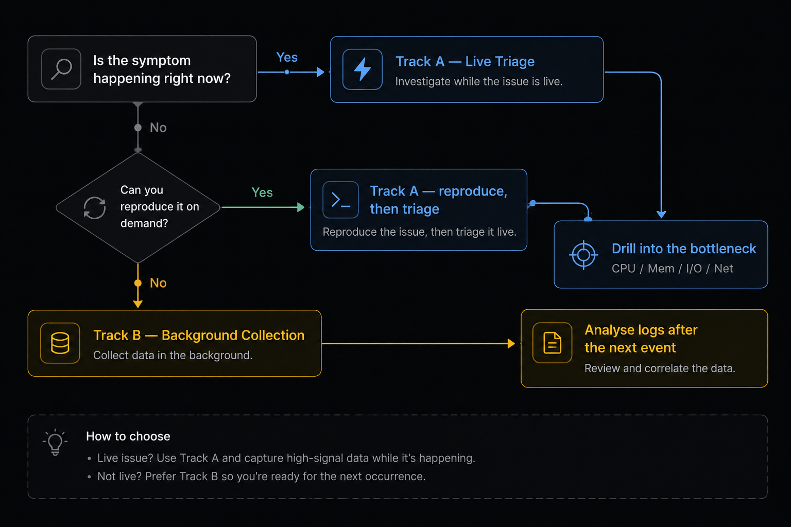

<i class="fas fa-tachometer-alt" aria-hidden="true"></i> A field-ready reference for Linux performance investigations — keep it open in a second terminal.

## How to use this playbook

Linux performance problems split cleanly into **two very different investigations**, and picking the wrong one wastes hours:

| Situation | Track | What you do |
|---|---|---|
| The problem is happening **right now** (or you can reproduce it on demand) | **Track A — Live Triage** | Interactive tools, sample at 1s intervals, follow the bottleneck |
| The problem is **intermittent / random** (happens overnight, once a week, only under load you can't reproduce) | **Track B — Background Collection** | Arm continuous loggers *before* the next occurrence, then mine the logs afterwards |


If you can't reproduce it, **do not** keep staring at `top`. Stop, deploy collectors, walk away, and analyse later. Otherwise you'll miss the event every single time.




---

## <i class="fas fa-robot" aria-hidden="true"></i> Recommended companion: LinuxAiOPerf

Before diving into individual tools, there is a tool worth installing on every box where you investigate performance: [**LinuxAiOPerf**](https://github.com/samatild/LinuxAiOPerf) — an **all-in-one Linux performance data collector** that wraps most of what's described below into a single, controllable session.

It is particularly powerful for **Track B (Background Collection)** because it:

- Starts and stops `vmstat`, `iostat`, `pidstat`, `mpstat`, `sar`, `ps`, `/proc` snapshots, and more **with a single command**
- Saves everything to a **timestamped directory** ready to attach to a ticket or share with engineering
- Handles **long unattended runs** without filling the disk
- Produces output that is easy to diff between "good" and "bad" windows


Use `LinuxAiOPerf` as your default collector. Reach for raw `vmstat` / `iostat` / `pidstat` only when you need something it does not capture, or when you want to *watch* something live in a second terminal.


```bash
# Download
wget https://raw.githubusercontent.com/samatild/LinuxAiOPerf/main/build/linux_aio_perfcheck.sh

# Make executable
chmod +x linux_aio_perfcheck.sh

# Run (interactive mode)
sudo ./linux_aio_perfcheck.sh
```

---

# Track A — Live Triage

You're on the box, the problem is visible. Goal: identify the **dominant bottleneck** (CPU, memory, I/O, or network) in under 60 seconds, then drill in.

## The 60-second triage

Run these in order. Stop as soon as one clearly points at a culprit.

```bash
# 1. Overall load and "is anything obviously wrong?"
uptime
dmesg -T | tail -50

# 2. CPU + run queue + swap + I/O wait, sampled every second
vmstat 1 5

# 3. Per-CPU breakdown (is one core pegged? is it user, system, or iowait?)
mpstat -P ALL 1 3

# 4. Top processes by CPU and memory
pidstat -u 1 3
pidstat -r 1 3

# 5. Disk pressure
iostat -xz 1 3

# 6. Memory truth
free -h
```

### Reading the first signs

| Signal in `vmstat 1` | Likely bottleneck |
|---|---|
| `r` consistently > number of CPUs | **CPU saturation** (run queue) |
| `b` > 0 with high `wa` | **I/O bottleneck** (processes stuck in D-state) |
| `si` / `so` > 0 | **Memory pressure** — swapping |
| `sy` very high (>30%) | **Kernel work** — syscalls, contention, interrupts |
| `us` very high with low `id` | **User-space CPU** — application is the culprit |

---

## `ps` — Process snapshot

```bash
ps aux                              # All processes: user, CPU, MEM, state, command
ps auxf                             # Same, with ASCII process tree
ps -eo pid,ppid,stat,comm           # Custom columns: PID, parent, state, name
ps -eo pid,ppid,stat,wchan,args     # Add wait-channel (what kernel fn it's blocked in)

# Filter by name
ps aux | grep nginx

# Show a specific PID
ps -p <PID> -o pid,ppid,stat,vsz,rss,comm

# Find processes in bad states
ps aux | awk '$8 ~ /^[DZ]/'         # D-state (uninterruptible) or zombies
```

### STAT column decoded

| Code | Meaning |
|------|---------|
| `R`  | Running or runnable (on CPU or in run queue) |
| `S`  | Interruptible sleep (waiting for event — can receive signals) |
| `D`  | Uninterruptible sleep (waiting on I/O — **cannot** be killed) |
| `T`  | Stopped (SIGSTOP or debugger) |
| `Z`  | Zombie (exited, waiting for parent to call `waitpid`) |
| `+`  | Foreground process group |
| `s`  | Session leader |
| `l`  | Multi-threaded |


They're blocked in the kernel, usually on I/O. Check `/proc/<PID>/wchan` to see *what* they're waiting on.


---

## `/proc` — Live kernel state

```bash
# Process status (state, memory, threads, signals)
cat /proc/<PID>/status

# Key fields
grep -E 'State|VmSize|VmRSS|VmSwap|Threads|SigCgt' /proc/<PID>/status

# What kernel function is the process sleeping in?
cat /proc/<PID>/wchan

# Full command line
cat /proc/<PID>/cmdline | tr '\0' ' '

# Open file descriptors
ls -la /proc/<PID>/fd

# Memory map (virtual address space)
cat /proc/<PID>/maps

# Detailed per-region memory accounting
cat /proc/<PID>/smaps_rollup

# System-wide memory
grep -E 'MemTotal|MemAvailable|SwapTotal|SwapFree' /proc/meminfo
```

### Key `/proc/meminfo` fields

| Field | Meaning |
|-------|---------|
| `MemTotal` | Total physical RAM |
| `MemAvailable` | RAM available for new allocations (**use this, not MemFree**) |
| `MemFree` | RAM not used at all (excludes reclaimable cache) |
| `Cached` | Page cache (reclaimable) |
| `SwapTotal` / `SwapFree` | Swap space |
| `Dirty` | Pages waiting to be written to disk |

---

## `vmstat` — System-wide memory + CPU

```bash
vmstat 1            # Update every 1 second (forever)
vmstat 1 30         # 30 samples, 1 second apart
vmstat -s           # Summary totals
vmstat -m           # Slab allocator stats
```

```text
procs --------memory--------- --swap- ---io-- -system- ------cpu-----
 r  b   swpd   free  buff cache  si  so   bi   bo   in   cs us sy id wa
```

| Column | Meaning |
|--------|---------|
| `r` | Processes in run queue (waiting for CPU) |
| `b` | Processes in uninterruptible sleep (D state) |
| `swpd` | Virtual memory used (kB) |
| `free` | Idle memory (kB) |
| `si` | Swap-in rate (kB/s — pages read from disk) |
| `so` | Swap-out rate (kB/s — pages written to disk) |
| `bi` / `bo` | Blocks in/out per second |
| `us` / `sy` / `id` / `wa` | CPU user / kernel / idle / iowait % |


`si` / `so` > 0 means you're swapping. `wa` > 20% means I/O is the bottleneck. `r` > CPU count = run-queue saturation.


---

## `pidstat` — Per-process statistics (sysstat)

```bash
# Install sysstat if needed
sudo apt-get install -y sysstat        # Debian/Ubuntu
sudo dnf install -y sysstat            # RHEL/Fedora
sudo zypper install -y sysstat         # SUSE

pidstat -u 1            # CPU usage
pidstat -r 1            # Memory (RSS, VSZ)
pidstat -d 1            # Disk I/O per process
pidstat -w 1            # Context switches
pidstat -urd 1          # All metrics combined
pidstat -p <PID> -u 1   # Filter for one PID
```

### `pidstat -u` columns (CPU)

| Column | Meaning |
|--------|---------|
| `%usr` | CPU time in user space |
| `%system` | CPU time in kernel |
| `%guest` | CPU time in virtual machine |
| `%wait` | Time waiting for CPU (high = CPU contention) |
| `%CPU` | Total CPU usage |

### `pidstat -r` columns (Memory)

| Column | Meaning |
|--------|---------|
| `minflt/s` | Minor page faults per second (no disk I/O) |
| `majflt/s` | Major page faults per second (**disk read required**) |
| `VSZ` | Virtual memory size (kB) — reserved, not necessarily in RAM |
| `RSS` | Resident Set Size (kB) — **actually in physical RAM** |
| `%MEM` | RSS as % of total RAM |


`RSS` is real memory usage. `VSZ` can be much larger — virtual memory is cheap until you actually touch the pages.


---

## `iostat` — Disk I/O statistics

```bash
iostat -xz 1          # Extended stats, skip idle devices, 1s interval
iostat -xz 1 10       # 10 samples
iostat -h 1           # Human-readable throughput
```

| Column | Meaning |
|--------|---------|
| `r/s` / `w/s` | Read / write requests per second |
| `rkB/s` / `wkB/s` | Read / write throughput (kB/s) |
| `await` | Average I/O wait time (ms) — **the key latency metric** |
| `r_await` / `w_await` | Average read / write latency (ms) |
| `aqu-sz` | Average queue depth |
| `%util` | Device utilisation % — 100% = saturated |


`await` > 20 ms on SSD = problem. `%util` near 100% = bottleneck — but on multi-queue SSDs, `%util` can be misleading, so trust `await` and queue depth.


---

## `free`, `top`, `htop`

```bash
free -h               # Human-readable
watch -n1 free -h     # Refresh every second

top                   # Classic interactive view
htop                  # Colourful interactive (sudo apt install htop)
```

`top` keys: `P` sort by CPU, `M` sort by memory, `1` toggle per-CPU, `d` change refresh, `k` kill PID, `q` quit.


Use **`available`**, not `free`, in the `free` output — `available` includes reclaimable cache. Plain `free` is misleading on Linux.


---

## `strace` & `lsof` — Drilling into a single process

```bash
# What syscalls is this process making right now?
strace -p <PID>

# Count syscalls (summary mode)
strace -c -p <PID>       # Ctrl-C after a few seconds

# Trace specific syscalls only
strace -e trace=read,write,open,openat,close -p <PID>

# Timestamps + time per syscall
strace -tt -T -p <PID>

# Who has this file/socket open?
lsof -p <PID>
lsof -i :443
lsof /var/log/syslog
```


`strace` slows the target process down significantly. Don't leave it attached to a production-critical process for long.


---

## `kill` — Sending signals

```bash
kill <PID>            # SIGTERM (15) — polite request
kill -KILL <PID>      # SIGKILL (9) — cannot be caught
kill -STOP <PID>      # Freeze (SIGSTOP — cannot be caught)
kill -CONT <PID>      # Resume
pkill nginx           # Kill by name
kill -l               # List all signals
```

| Signal | Number | Catchable | Meaning |
|--------|--------|-----------|---------|
| `SIGTERM` | 15 | ✅ | Graceful shutdown request |
| `SIGKILL` | 9  | ❌ | Immediate kill |
| `SIGSTOP` | 19 | ❌ | Freeze process |
| `SIGCONT` | 18 | ✅ | Resume |
| `SIGINT`  | 2  | ✅ | Interrupt (Ctrl-C) |
| `SIGHUP`  | 1  | ✅ | Hangup / reload config |
| `SIGUSR1` / `SIGUSR2` | 10 / 12 | ✅ | Application-defined |

---

# Track B — Background Collection

The symptom is **intermittent**. You won't catch it live. The goal is to **arm collectors before the next event** and then go back and analyse the logs after it happens.

## The golden rule


Start collecting **before** the problem reproduces, not after. If a customer says "it happened at 03:14 last night," your only chance of catching the next one is data that was already being written at 03:13.


## Option 1 (recommended): LinuxAiOPerf

```bash
# Download
wget https://raw.githubusercontent.com/samatild/LinuxAiOPerf/main/build/linux_aio_perfcheck.sh

# Make executable
chmod +x linux_aio_perfcheck.sh

# Run (interactive mode)
sudo ./linux_aio_perfcheck.sh
```

This is the path of least resistance for an unattended overnight collection. One command, one output directory, everything correlated by timestamp.

## Option 2: Manual sysstat + `tee` loggers

If you can't install anything new, the classic sysstat tools work fine. Run each one in its own `tmux` / `screen` window (or as `systemd-run --unit=...` units) and redirect to dated log files.

```bash
# Pick a run directory
RUN=/var/log/perfrun-$(date +%Y%m%d-%H%M%S)
mkdir -p "$RUN"

# CPU + memory + I/O + run queue, every 5s
vmstat -t 5     | tee "$RUN/vmstat.log"   &

# Per-CPU breakdown
mpstat -P ALL 5 | tee "$RUN/mpstat.log"   &

# Per-process CPU, mem and I/O
pidstat -urd 5  | tee "$RUN/pidstat.log"  &

# Disk extended stats
iostat -xtz 5   | tee "$RUN/iostat.log"   &

# Network interfaces
sar -n DEV 5    | tee "$RUN/sar-net.log"  &

# Periodic process snapshot
while true; do
  date '+=== %F %T ===' >> "$RUN/ps.log"
  ps -eo pid,ppid,stat,pcpu,pmem,rss,vsz,wchan:25,args --sort=-pcpu \
    | head -50 >> "$RUN/ps.log"
  sleep 30
done &
```


Each tool prints its own timestamp (`-t`, `-tt`, `sar`'s default), which is essential for correlating across files when reviewing later.


## Option 3: Let `sar` quietly record everything

`sar` is the unsung hero of intermittent issues. The sysstat package ships a cron/systemd timer that writes a binary record of system activity every 10 minutes by default — you can tighten this to every minute.

```bash
# Enable and start the collector
sudo systemctl enable --now sysstat

# On most distros, tighten the sample interval:
sudo sed -i 's|^\*/10 |*/1 |' /etc/cron.d/sysstat 2>/dev/null || true
# (On systems using the systemd timer, edit sysstat-collect.timer instead)
```

Then, **after the event**, mine the history:

```bash
# CPU history for a specific day (day-of-month)
sar -u -f /var/log/sysstat/sa15

# Restrict to the window of interest
sar -u -s 03:00:00 -e 04:00:00 -f /var/log/sysstat/sa15

# Memory, swap, I/O, network, run queue, context switches
sar -r -f /var/log/sysstat/sa15
sar -S -f /var/log/sysstat/sa15
sar -b -f /var/log/sysstat/sa15
sar -n DEV -f /var/log/sysstat/sa15
sar -q -f /var/log/sysstat/sa15
sar -w -f /var/log/sysstat/sa15
```

## Option 4: Triggered capture

For "I only need data *when something is wrong*" cases, gate the collection on a threshold. Example: dump rich diagnostics when load average crosses 10.

```bash
THRESHOLD=10
OUT=/var/log/perf-trigger
mkdir -p "$OUT"

while true; do
  L=$(awk '{print int($1)}' /proc/loadavg)
  if [ "$L" -ge "$THRESHOLD" ]; then
    TS=$(date +%Y%m%d-%H%M%S)
    {
      echo "=== $TS load=$L ==="
      uptime
      ps -eo pid,stat,pcpu,pmem,rss,wchan:25,args --sort=-pcpu | head -40
      cat /proc/meminfo
      vmstat 1 5
      iostat -xz 1 3
    } >> "$OUT/triggers-$TS.log"
    sleep 60   # cool-down so we don't spam
  fi
  sleep 5
done
```

The same pattern works for memory thresholds, D-state process counts, specific log-line matches, or any other signal.

## Analysing the logs afterwards

```bash
# When did we swap?
awk 'NR>2 && ($7>0 || $8>0)' vmstat.log

# When did %iowait spike?
awk 'NR>3 && $16>20' vmstat.log     # column index depends on vmstat version

# Which processes had the biggest RSS over time?
awk '$6 > 500000' pidstat.log

# Which disks went past 20ms await?
awk '$10 > 20' iostat.log
```


Correlate your collected logs with `journalctl --since=... --until=...` and `dmesg -T`. The kernel ring buffer often shows OOM kills, hung tasks, or block-device errors that explain what the metrics were reacting to.


---

## Quick diagnostic workflow (cheatsheet)

```bash
# 1. What's using CPU right now?
pidstat -u 1 60 | tee /tmp/cpu.log

# 2. What's using memory?
pidstat -r 1 30 | tee /tmp/mem.log
awk '$6 > 100000' /tmp/mem.log          # RSS > 100 MB

# 3. Is the system swapping?
vmstat 1 10                              # watch si / so

# 4. Is disk I/O the bottleneck?
iostat -xz 1 10                          # watch await, %util

# 5. Find processes in bad states
ps aux | awk '$8 ~ /^[DZ]/'              # D-state or zombies

# 6. What is a specific process waiting on?
cat /proc/<PID>/wchan
grep State /proc/<PID>/status

# 7. How much memory is a process really using?
grep -E 'VmRSS|VmSwap|VmSize' /proc/<PID>/status
cat /proc/<PID>/smaps_rollup

# 8. Is a process leaking memory? Watch RSS over time.
watch -n2 'grep VmRSS /proc/<PID>/status'

# 9. Was there an OOM kill / hung task / disk error?
dmesg -T | grep -iE 'oom|killed process|hung task|i/o error|blocked for'
journalctl -k --since "1 hour ago" | grep -iE 'oom|hung|error'
```

---

## TL;DR

- **Decide first**: is this Track A (live) or Track B (intermittent)? Don't try to catch a rare event by staring at `top`.
- **For live triage**, run the 60-second sweep: `vmstat`, `mpstat`, `pidstat -urd`, `iostat -xz`, `free -h`. Stop as soon as the bottleneck is obvious.
- **For intermittent issues**, deploy [`LinuxAiOPerf`](https://github.com/samatild/LinuxAiOPerf) — or arm `sar` plus a handful of `tee`'d collectors — *before* the next occurrence and mine the logs after.
- Always **correlate metrics with `dmesg -T` and `journalctl`**. The kernel usually tells you what the numbers were reacting to.
