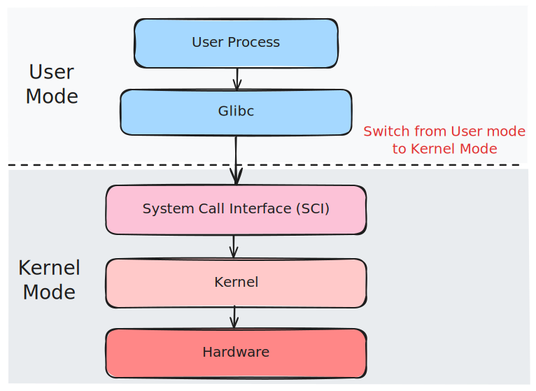

<i class="fas fa-shield-alt" aria-hidden="true"></i> CPU Privilege Levels and Execution Contexts

## Summary

Modern processors implement hardware-enforced privilege levels to isolate untrusted user code from critical kernel services. Linux uses two primary modes: **kernel mode** (ring 0, CPL 0, EL1) and **user mode** (ring 3, CPL 3, EL0). Kernel mode grants unrestricted access to CPU features, physical memory, I/O ports, and privileged instructions. User mode restricts access to a virtualized, isolated address space and requires kernel mediation for hardware resources. The transition between modes occurs via system calls, interrupts, and exceptions, all managed by the kernel's interrupt and system call handlers. Understanding this separation is fundamental to security, performance optimization, and kernel debugging.

## CPU Privilege Levels (Architecture Overview)

### x86/x86-64 Privilege Rings

The x86 architecture defines four privilege levels (rings 0-3), though Linux uses only rings 0 and 3:

<figure style="background: #252525; padding: 1.2rem; border-radius: 10px; display: inline-block;">
  <a href="images/Priv_rings.svg" target="_blank" rel="noopener">
    
  </a>
  <figcaption style="color: #aaa; text-align: center; margin-top: 0.6rem; font-size: 0.97em;">
    CPU Privilege Levels: Rings 0–3 (Click to expand)
  </figcaption>
</figure>


- **Ring 0 (Kernel Mode)**: Highest privilege, executes kernel code, device drivers, interrupt handlers
- **Ring 1-2**: Unused by Linux (historically used for device drivers or hypervisors)
- **Ring 3 (User Mode)**: Lowest privilege, executes user applications

**Current Privilege Level (CPL)**: Stored in the lower 2 bits of the `CS` (Code Segment) register:
- `CPL=0`: Kernel mode
- `CPL=3`: User mode

**Kernel source:** `arch/x86/include/asm/segment.h`

```c
// Simplified CPL check macros
#define user_mode(regs) (((regs)->cs & SEGMENT_RPL_MASK) == USER_CS)
#define kernel_mode(regs) (!user_mode(regs))
```

### ARM64 Exception Levels

ARM64 uses Exception Levels (EL0-EL3):

<figure style="background: #252525; padding: 1.2rem; border-radius: 10px; display: inline-block;">
  <a href="images/exceptionlevels.svg" target="_blank" rel="noopener">
    
  </a>
  <figcaption style="color: #aaa; text-align: center; margin-top: 0.6rem; font-size: 0.97em;">
    ARM64 Exception Levels: EL0–EL3 (Click to expand)
  </figcaption>
</figure>


<aside style="font-size:0.98em; color:#888; border-left:3px solid #6E8AA4; padding-left:1em; margin-bottom: 1.2em;">
  <strong>Source:</strong> <a href="https://developer.arm.com/documentation/102412/0103/Privilege-and-Exception-levels/Exception-levels?lang=en#md214-exception-levels__fig_exception_levels" target="_blank" rel="noopener">ARM Developer - Exception Levels</a>
</aside>


- **EL0 (User Mode)**: Applications and user-space code
- **EL1 (Kernel Mode)**: Linux kernel, hypervisor in some configurations
- **EL2 (Hypervisor)**: Virtualization layer (KVM, Xen)
- **EL3 (Secure Monitor)**: TrustZone secure world

**Current Exception Level (EL)**: Stored in `CurrentEL` system register (bits [3:2])

**Kernel source:** `arch/arm64/include/asm/ptrace.h`

```c
#define PSR_MODE_EL0t  0x00000000
#define PSR_MODE_EL1t  0x00000004
#define PSR_MODE_EL1h  0x00000005
```

## Kernel Mode Characteristics

### Privileges and Capabilities

**1. Unrestricted Memory Access**
- Direct access to physical memory addresses
- Can read/write kernel data structures
- Access to kernel address space (typically `0xffff800000000000` and above on x86-64)
- Can modify page tables, MMU configuration

**2. Privileged Instructions**
- `cli`/`sti` (disable/enable interrupts)
- `lgdt`/`lidt` (load GDT/IDT)
- `mov crX` (control register access)
- `in`/`out` (I/O port access)
- `hlt` (halt CPU)
- `wrmsr`/`rdmsr` (Model-Specific Registers)

**3. Interrupt and Exception Handling**
- Can install interrupt handlers
- Access to interrupt controller (APIC, GIC)
- Exception vector table modification

**4. System Control**
- CPU scheduling decisions
- Process creation/destruction
- File system operations
- Network stack management

**Kernel example - Direct memory access:**

```c
// Kernel can directly access physical memory
void *phys_addr = __va(0x1000000);  // Convert physical to virtual
unsigned long value = *(unsigned long *)phys_addr;

// User mode cannot do this - would cause segmentation fault
```

### Kernel Mode Execution Contexts

**1. Process Context**
- Executing on behalf of a user process (system call handler)
- Has associated `task_struct`, user-space memory mappings
- Can sleep, be preempted
- Example: `read()`, `write()`, `open()` syscall handlers

**2. Interrupt Context**
- Executing in response to hardware interrupt
- No associated process (`current` may point to interrupted process)
- Cannot sleep, very limited blocking operations
- Must be fast and non-blocking
- Example: Network packet received, timer interrupt

**3. Softirq/Tasklet Context**
- Deferred interrupt processing
- Can run in interrupt context or `ksoftirqd` thread
- Similar constraints to interrupt context
- Example: Network packet processing, timer callbacks

**Kernel source - Process context check:**

```c
// arch/x86/kernel/entry_64.S
ENTRY(entry_SYSCALL_64)
    // Save user context
    SWAPGS
    movq    %rsp, PER_CPU_VAR(cpu_current_top_of_stack)
    
    // Switch to kernel stack
    movq    PER_CPU_VAR(cpu_current_top_of_stack), %rsp
    
    // Now in kernel mode, process context
    call    do_syscall_64
```

## User Mode Characteristics

### Restrictions and Isolation

**1. Virtual Memory Only**
- Cannot access physical addresses directly
- Limited to virtual address space (typically `0x0000000000000000` to `0x00007fffffffffff` on x86-64)
- Page tables managed by kernel, not user-space
- Segmentation fault on invalid access

**2. No Privileged Instructions**
- Attempting privileged instructions causes General Protection Fault (#GP)
- Trapped by kernel, typically results in `SIGSEGV` to process

**3. System Call Interface**
- Must use system calls to request kernel services
- System calls are the controlled entry point to kernel mode
- Each syscall has defined parameters and return values

**4. Process Isolation**
- Each process has independent virtual address space
- Cannot directly access other processes' memory
- Inter-process communication requires kernel mediation (shared memory, pipes, sockets)

**User-space example - Attempting privileged operation:**

```c
// This will fail in user mode
int main() {
    unsigned long cr0;
    asm volatile("mov %%cr0, %0" : "=r"(cr0));  // Privileged instruction
    // Result: SIGSEGV - Segmentation fault
    return 0;
}
```

**User-space example - Valid system call:**

```c
// User mode must use system calls
int main() {
    int fd = open("/etc/passwd", O_RDONLY);  // System call
    if (fd < 0) {
        perror("open");
        return 1;
    }
    close(fd);  // System call
    return 0;
}
```

## Mode Transitions: System Calls

### System Call Mechanism

System calls are the controlled mechanism for transitioning from user mode to kernel mode. The transition involves:

1. **User-space preparation**: Set up syscall number and arguments
2. **Hardware trap**: CPU switches to kernel mode via special instruction
3. **Kernel handler**: Kernel validates and executes requested operation
4. **Return**: Kernel switches back to user mode with result

### x86-64 System Call Interface

<figure style="background: #252525; padding: 1.2rem; border-radius: 10px; display: inline-block;">
  <a href="images/user2kernel.svg" target="_blank" rel="noopener">
    
  </a>
  <figcaption style="color: #aaa; text-align: center; margin-top: 0.6rem; font-size: 0.97em;">
    Transition from User Mode to Kernel Mode via System Call (Click to expand)
  </figcaption>
</figure>


**Syscall instruction (`syscall`):**
- Fastest method on x86-64
- System call number in `%rax`
- Arguments in `%rdi`, `%rsi`, `%rdx`, `%r10`, `%r8`, `%r9`
- Return value in `%rax`
- Return address in `%rcx`

**Kernel source:** `arch/x86/entry/entry_64.S`

```c
// User-space syscall invocation (glibc wrapper)
static inline long __syscall0(long n) {
    long ret;
    asm volatile ("syscall" : "=a"(ret) : "a"(n) : "rcx", "r11", "memory");
    return ret;
}

// Kernel entry point
ENTRY(entry_SYSCALL_64)
    UNWIND_HINT_EMPTY
    
    // Swap GS to kernel space
    swapgs
    
    // Save user-space registers
    movq    %rsp, PER_CPU_VAR(cpu_current_top_of_stack)
    
    // Load kernel stack
    movq    PER_CPU_VAR(cpu_current_top_of_stack), %rsp
    
    // Call C handler
    call    do_syscall_64
```

**Alternative: `int 0x80` (legacy):**
- Slower, uses interrupt mechanism
- Still supported for 32-bit compatibility
- Uses interrupt descriptor table (IDT)

### ARM64 System Call Interface

**`svc` (Supervisor Call) instruction:**
- System call number in `x8` (W8)
- Arguments in `x0-x7`
- Return value in `x0`

**Kernel source:** `arch/arm64/kernel/entry.S`

```c
// User-space syscall invocation
long syscall(long n, ...) {
    register long ret asm("x0");
    register long syscall_nr asm("x8") = n;
    asm volatile ("svc #0" : "=r"(ret) : "r"(syscall_nr) : "memory");
    return ret;
}
```

### System Call Handler Flow

**Kernel source:** `kernel/sys.c`, `arch/x86/entry/common.c`

```c
// Simplified syscall handler
__visible noinstr void do_syscall_64(struct pt_regs *regs, int nr) {
    // Validate syscall number
    if (likely(nr < NR_syscalls)) {
        // Get syscall function pointer
        syscall_fn_t syscall_fn = syscall_table[nr];
        
        // Execute syscall (still in kernel mode)
        regs->ax = syscall_fn(regs);
    } else {
        regs->ax = -ENOSYS;
    }
    
    // Return to user mode
    syscall_exit_to_user_mode(regs);
}
```

**Practical example - Tracing system calls:**

```bash
# Trace all syscalls made by a process
strace -e trace=all ls -l

# Example output:
# openat(AT_FDCWD, "/etc/ld.so.cache", O_RDONLY|O_CLOEXEC) = 3
# read(3, "\177ELF\2\1\1\3\0\0\0\0\0\0\0\0\3\0>\0\1\0\0\0\360\3\2\0\0\0\0\0"..., 832) = 832
# close(3)                                = 0
# openat(AT_FDCWD, ".", O_RDONLY|O_NONBLOCK|O_CLOEXEC|O_DIRECTORY) = 3
# getdents64(3, /* 5 entries */, 32768)  = 144
# close(3)                                = 0
```

## Memory Protection and Address Spaces

### Virtual Address Space Layout

**x86-64 User-Space (Linux):**
```
0x0000000000000000 - 0x00007fffffffffff: User-space (128 TB)
    ├─ 0x0000000000400000: Code segment (.text)
    ├─ 0x00007fffff000000: Stack (grows downward)
    ├─ 0x00007ffffffde000: vDSO (virtual dynamic shared object)
    └─ 0x00007ffffffff000: Stack guard page
```

**x86-64 Kernel-Space:**
```
0xffff800000000000 - 0xffffffffffffffff: Kernel-space (128 TB)
    ├─ 0xffff888000000000: Direct mapping of physical memory
    ├─ 0xffffc90000000000: vmalloc area
    ├─ 0xffffea0000000000: Vmemmap (struct page array)
    └─ 0xffffffff80000000: Kernel code (text segment)
```

**Kernel source:** `arch/x86/include/asm/page_64_types.h`

```c
#define __PAGE_OFFSET_BASE      _AC(0xffff880000000000, UL)
#define __PAGE_OFFSET           __PAGE_OFFSET_BASE
#define __START_KERNEL_map      _AC(0xffffffff80000000, UL)
```

### Page Table Protection

**Page Table Entry (PTE) flags:**
- **User/Supervisor (U/S) bit**: Controls user vs kernel access
  - `U/S=0`: Kernel-only pages (kernel mode access)
  - `U/S=1`: User-accessible pages (both modes)
- **Read/Write (R/W) bit**: Controls write permissions
- **Execute Disable (NX) bit**: Prevents code execution (DEP/XN)

**Kernel source:** `arch/x86/include/asm/pgtable_types.h`

```c
#define _PAGE_BIT_PRESENT   0
#define _PAGE_BIT_RW        1
#define _PAGE_BIT_USER      2
#define _PAGE_BIT_PWT       3
#define _PAGE_BIT_PCD       4
#define _PAGE_BIT_ACCESSED  5
#define _PAGE_BIT_DIRTY     6
#define _PAGE_BIT_PSE       7
#define _PAGE_BIT_PAT       7
#define _PAGE_BIT_GLOBAL    8
#define _PAGE_BIT_SOFTW1    9
#define _PAGE_BIT_SOFTW2    10
#define _PAGE_BIT_SOFTW3    11
#define _PAGE_BIT_PAT_LARGE 12
#define _PAGE_BIT_SPECIAL   _PAGE_BIT_SOFTW1
#define _PAGE_BIT_CPA_TEST  _PAGE_BIT_SOFTW1
#define _PAGE_BIT_NX        63
```

**Practical example - Checking page permissions:**

```bash
# View memory mappings of a process
cat /proc/self/maps

# Example output:
# 00400000-00401000 r-xp 00000000 08:01 123456 /bin/cat      (executable, read-only)
# 00600000-00601000 r--p 00000000 08:01 123456 /bin/cat      (read-only data)
# 00601000-00602000 rw-p 00001000 08:01 123456 /bin/cat      (read-write data)
# 7fff00000000-7fff00001000 rw-p 00000000 00:00 0            (stack, read-write)
# ffffffffff600000-ffffffffff601000 r-xp 00000000 00:00 0    (vsyscall, kernel-managed)
```

### Segmentation Fault Handling

When user-mode code attempts invalid access:

1. **CPU generates page fault** (#PF exception)
2. **Kernel page fault handler** (`do_page_fault()`) executes
3. **Kernel checks**:
   - Address validity
   - Permissions (U/S bit, R/W bit)
   - If invalid → send `SIGSEGV` to process
   - If valid (copy-on-write, lazy allocation) → fix mapping and resume

**Kernel source:** `arch/x86/mm/fault.c`

```c
static void
__do_page_fault(struct pt_regs *regs, unsigned long error_code,
                unsigned long address) {
    struct vm_area_struct *vma;
    struct mm_struct *mm = current->mm;
    
    // Check if fault occurred in kernel mode
    if (unlikely(fault_in_kernel_space(address))) {
        // Kernel-mode fault handling
        do_kern_addr_fault(regs, error_code, address);
        return;
    }
    
    // User-mode fault
    vma = find_vma(mm, address);
    if (!vma) {
        // Invalid address - send SIGSEGV
        bad_area(regs, error_code, address);
        return;
    }
    
    // Check permissions
    if (unlikely(access_error(error_code, vma))) {
        bad_area_access_error(regs, error_code, address, vma);
        return;
    }
    
    // Valid fault - handle (COW, lazy allocation, etc.)
    fault = handle_mm_fault(vma, address, flags, regs);
}
```

## Interrupts and Exceptions

### Interrupt Handling Flow

**Hardware interrupt sequence:**

1. **Hardware device** asserts interrupt line
2. **CPU** finishes current instruction
3. **CPU** switches to kernel mode (CPL=0)
4. **CPU** saves user context (registers, return address)
5. **Kernel interrupt handler** executes
6. **Kernel** returns to user mode (or schedules different task)

**Kernel source:** `arch/x86/entry/entry_64.S`

```c
// Interrupt entry point
ENTRY(common_interrupt)
    // Save all registers
    SAVE_ALL
    
    // Disable interrupts (if needed)
    cli
    
    // Call C interrupt handler
    call    do_IRQ
    
    // Restore and return
    RESTORE_ALL
    iretq
```

### Exception Types

**Faults** (correctable):
- Page fault (#PF): Virtual memory access violation
- General Protection Fault (#GP): Invalid memory access, privilege violation
- Division Error (#DE): Divide by zero

**Traps** (instruction completes):
- Breakpoint (#BP): `int3` instruction, debugger breakpoints
- Overflow (#OF): Arithmetic overflow

**Aborts** (severe errors):
- Double Fault (#DF): Exception during exception handling
- Machine Check (#MC): Hardware error

**All exceptions transition to kernel mode** for handling.

## Security Implications

### Why Separation Matters

**1. Process Isolation**
- User processes cannot access each other's memory
- Kernel enforces access control via page tables
- Prevents malicious or buggy programs from affecting others

**2. Resource Protection**
- Hardware resources (I/O ports, MSRs) protected from user access
- File system integrity maintained by kernel
- Network stack isolation prevents packet manipulation

**3. Privilege Escalation Prevention**
- User code cannot directly execute privileged instructions
- System calls are the only controlled entry point
- Kernel validates all requests before execution

**Security example - Attempted privilege escalation:**

```c
// User-space code attempting to access kernel memory
int main() {
    // Attempt to read kernel address space
    unsigned long *kernel_addr = (unsigned long *)0xffffffff80000000;
    unsigned long value = *kernel_addr;  // Page fault!
    // Result: SIGSEGV - Segmentation fault
    // Kernel prevents user access to kernel memory
    return 0;
}
```

### System Call Validation

**Kernel validates all syscall parameters:**

```c
// Example: open() syscall validation
SYSCALL_DEFINE3(open, const char __user *, filename, int, flags, umode_t, mode) {
    // Validate filename pointer (user-space address)
    if (get_user(path, filename))
        return -EFAULT;
    
    // Validate path length
    if (strnlen_user(path, MAX_PATH) > MAX_PATH)
        return -ENAMETOOLONG;
    
    // Check permissions
    if (!may_open(&nd.path, acc_mode, open_flag))
        return -EACCES;
    
    // Proceed with file opening
    return do_filp_open(dfd, tmp, &op);
}
```

## Practical Examples and Demonstrations

### Example 1: Observing Mode Transitions

**Trace system calls and mode switches:**

```bash
# Install perf tools
sudo apt-get install linux-perf

# Trace syscalls with timing
sudo perf trace -e syscalls:sys_enter_openat,syscalls:sys_exit_openat ls

# Output shows:
# 0.000 openat(AT_FDCWD, "/etc/ld.so.cache", O_RDONLY|O_CLOEXEC) = 3
# 0.012 <... openat resumed> )      = 3
# Each line shows user->kernel->user transition
```

### Example 2: Kernel vs User Memory Access

**User-space program:**

```c
#include <stdio.h>
#include <unistd.h>
#include <sys/mman.h>

int main() {
    // User-space memory allocation
    void *user_addr = mmap(NULL, 4096, PROT_READ|PROT_WRITE,
                          MAP_PRIVATE|MAP_ANONYMOUS, -1, 0);
    
    printf("User-space address: %p\n", user_addr);
    *(int *)user_addr = 42;  // OK - user can write to own memory
    
    // Attempt kernel-space access
    void *kernel_addr = (void *)0xffffffff80000000;
    // *(int *)kernel_addr = 42;  // Would cause SIGSEGV
    
    return 0;
}
```

**Kernel module (for comparison):**

```c
// Kernel module can access both
static int __init test_init(void) {
    void *user_addr = (void *)0x400000;  // User-space address
    void *kernel_addr = (void *)0xffffffff80000000;  // Kernel address
    
    // Access kernel memory (requires proper mapping)
    // unsigned long val = *(unsigned long *)kernel_addr;
    
    // Access user memory (requires copy_from_user)
    // unsigned long val;
    // copy_from_user(&val, user_addr, sizeof(val));
    
    return 0;
}
```

### Example 3: System Call Overhead

**Measure syscall overhead:**

```c
#include <stdio.h>
#include <sys/time.h>
#include <unistd.h>

int main() {
    struct timeval start, end;
    long iterations = 1000000;
    
    gettimeofday(&start, NULL);
    for (long i = 0; i < iterations; i++) {
        getpid();  // System call
    }
    gettimeofday(&end, NULL);
    
    long us = (end.tv_sec - start.tv_sec) * 1000000 +
              (end.tv_usec - start.tv_usec);
    printf("Average syscall time: %.2f nanoseconds\n",
           (us * 1000.0) / iterations);
    
    return 0;
}

// Typical output: ~200-500 nanoseconds per syscall
// This includes: user->kernel transition + handler + kernel->user return
```

### Example 4: Inspecting Current Mode

**Check if code is running in kernel or user mode:**

```bash
# From user-space (always shows user mode)
cat /proc/self/status | grep State

# From kernel module (can check current mode)
# In kernel code:
if (user_mode(regs)) {
    printk("Running in user mode\n");
} else {
    printk("Running in kernel mode\n");
}
```

## Kernel Internals: Mode Switching Code

### Context Switch and Mode Return

**Returning to user mode after syscall:**

```c
// arch/x86/entry/common.c
__visible noinstr void syscall_exit_to_user_mode(struct pt_regs *regs) {
    // Check for pending work (signals, preemption)
    exit_to_user_mode_prepare(regs);
    
    // Restore user-space registers
    __syscall_exit_to_user_mode_work(regs);
}

static __always_inline void __syscall_exit_to_user_mode_work(struct pt_regs *regs) {
    // Restore GS (swap back to user GS)
    swapgs;
    
    // Return to user mode
    // IRET instruction restores:
    // - CS (code segment) -> CPL=3
    // - SS (stack segment)
    // - RFLAGS (flags register)
    // - RIP (instruction pointer)
    // - RSP (stack pointer)
}
```

### Interrupt Return

**Returning from interrupt handler:**

```c
// arch/x86/entry/entry_64.S
ENTRY(common_interrupt_return)
    // Check if returning to user mode
    testb   $3, CS(%rsp)
    jnz     swapgs_restore_regs_and_return_to_usermode
    
    // Returning to kernel mode
    RESTORE_ALL
    iretq

swapgs_restore_regs_and_return_to_usermode:
    // Swap GS back to user mode
    swapgs
    RESTORE_ALL
    iretq
```

## Performance Considerations

### System Call Overhead

**Factors affecting syscall performance:**

1. **Mode transition cost**: ~50-100 CPU cycles
2. **Register save/restore**: ~100-200 cycles
3. **Cache effects**: TLB flushes, cache misses
4. **Handler execution**: Varies by syscall (nanoseconds to microseconds)

**Optimization techniques:**

- **vDSO (Virtual Dynamic Shared Object)**: Some syscalls (e.g., `gettimeofday()`) execute in user-space
- **Batch syscalls**: `io_uring`, `sendmmsg()` reduce per-call overhead
- **Avoid unnecessary syscalls**: Cache results, use memory-mapped I/O

### Reducing Mode Transitions

**Example - Reducing `gettimeofday()` overhead:**

```c
// Traditional approach (syscall each time)
for (int i = 0; i < 1000; i++) {
    gettimeofday(&tv, NULL);  // 1000 syscalls
}

// Optimized approach (vDSO - no syscall)
#include <sys/time.h>
#include <time.h>

for (int i = 0; i < 1000; i++) {
    clock_gettime(CLOCK_REALTIME, &ts);  // May use vDSO, no syscall
}
```

## Debugging and Inspection Tools

### Identifying Mode Transitions

**1. Using `strace`:**

```bash
# Trace all syscalls (shows user->kernel transitions)
strace -c ls -l

# Output:
# % time     seconds  usecs/call     calls    errors syscall
# ------ ----------- ----------- --------- --------- ----------------
#  23.45    0.000234         234      1000           openat
#  15.23    0.000152         152      1000           read
#  10.12    0.000101         101      1000           close
```

**2. Using `perf`:**

```bash
# Sample syscall events
sudo perf record -e syscalls:sys_enter_* -a sleep 1
sudo perf report

# Trace syscall latency
sudo perf trace --duration 1
```

**3. Using `gdb` with kernel:**

```bash
# Attach to running kernel (requires kgdb)
(gdb) target remote /dev/ttyS0
(gdb) break do_syscall_64
(gdb) continue
# Breakpoint shows entry to kernel mode
```

### Kernel Logging

**Monitor mode transitions in kernel logs:**

```bash
# Enable kernel debugging
echo 8 > /proc/sys/kernel/printk  # Enable all log levels

# Watch for syscall-related messages
dmesg -w | grep -i "syscall\|fault\|segfault"
```

## Common Pitfalls and Misconceptions

### Misconception 1: "Kernel mode is always faster"

**Reality:** Mode transitions have overhead. Kernel mode itself isn't faster; it's necessary for privileged operations. User-space code can be faster for pure computation.

### Misconception 2: "System calls are expensive"

**Reality:** Modern CPUs optimize syscall transitions. Overhead is typically 200-500 nanoseconds, negligible for most applications. I/O operations (disk, network) dominate latency, not syscall overhead.

### Misconception 3: "Kernel code always runs in kernel mode"

**Reality:** Kernel code executes in kernel mode, but kernel threads can be scheduled like user processes. Interrupt handlers run in interrupt context, not process context.

### Misconception 4: "User-space cannot access kernel memory"

**Reality:** User-space can access kernel memory through `/proc`, `/sys`, and `mmap()` of kernel-exported memory (e.g., `/dev/mem` with proper permissions). The kernel controls what is exposed.

## References and Further Reading

- **Intel 64 and IA-32 Architectures Software Developer's Manual**: Volume 3A (System Programming Guide) - Privilege levels and protection
- **ARM Architecture Reference Manual**: Exception levels and privilege model
- **Linux Kernel Source**: `arch/x86/entry/` (system call and interrupt entry code)
- **Understanding the Linux Kernel (3rd ed.)**: Chapter 1 (Introduction), Chapter 3 (Processes)
- **Linux Device Drivers (3rd ed.)**: Chapter 9 (Interrupt Handling)
- **man 2 syscalls**: System call documentation
- **man 2 syscall**: Generic system call wrapper

---

<i class="fas fa-info-circle" aria-hidden="true"></i> **Note:** The distinction between kernel mode and user mode is fundamental to operating system security and stability. All privileged operations must occur in kernel mode, while user applications run in isolated user mode with controlled access to system resources via system calls.

