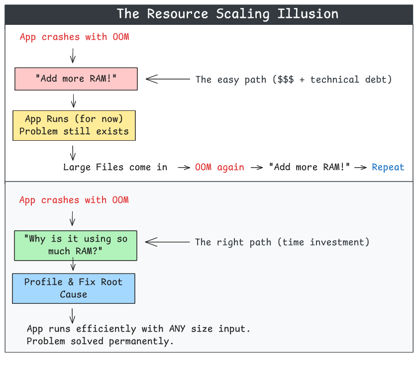
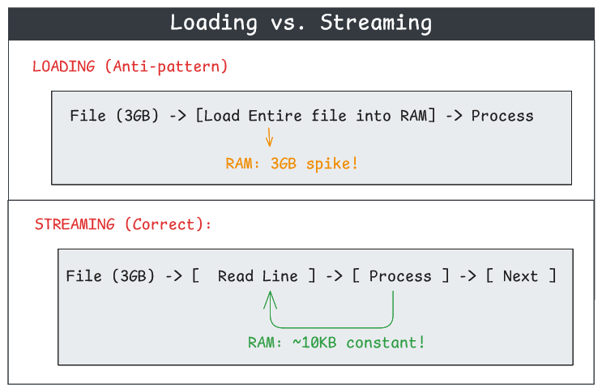

<i class="fas fa-microchip" aria-hidden="true"></i> Before You Scale: Why Software Optimization Beats Hardware Every Time

## Summary

When your application crashes with an Out-of-Memory (OOM) error, the instinctive response is often: "Let's add more RAM." In the age of cloud computing where resources are just a slider away, this approach has become the default. But what if I told you that a 30-minute code investigation could reduce your memory usage by **95%**—turning a 3GB memory spike into 150MB?

This article explores why **understanding your code before scaling your infrastructure** is a lost art worth reviving, and provides practical techniques to identify and fix memory inefficiencies.

Key takeaways:
- **Resource scaling hides bugs** - Adding RAM doesn't fix the underlying problem
- **Modern apps are bloated** - Easy access to resources has made developers lazy
- **Profiling is essential** - You can't fix what you can't measure
- **Streaming beats loading** - Process data incrementally, not all at once

## The Problem: Resources Are Too Easy to Get

<figure style="background: #252525; padding: 1.2rem; border-radius: 10px; display: inline-block;">
  <a href="images/1.png" target="_blank" rel="noopener">
    
  </a>
  <figcaption style="color: #aaa; text-align: center; margin-top: 0.6rem; font-size: 0.97em;">
    The Resource Scaling Illusion (Click to expand)
  </figcaption>
</figure>

In the 1990s, developers had to be clever. Memory was expensive, CPUs were slow, and every byte counted. Today, we can spin up a 64GB RAM instance with a few clicks. This convenience has created a generation of software that's fundamentally wasteful.

### The Real Cost of "Just Add More RAM"

| Approach | Initial Cost | Ongoing Cost | Scalability | Technical Debt |
|----------|--------------|--------------|-------------|----------------|
| Add more RAM | Low (5 min) | High ($$$) | Poor | Accumulates |
| Fix the code | Medium (1-4 hrs) | None | Excellent | Eliminated |

## Case Study: The 3GB Memory Spike

Let's walk through a real-world scenario. You have a Python web application that processes uploaded files—think log analyzers, report generators, or data processors.

### The Symptom

Your application runs fine locally but crashes in Kubernetes with OOM errors:

```
Container killed due to OOM (Out of Memory)
Last state: Terminated
Reason: OOMKilled
Exit Code: 137
```

Your first instinct? Increase the memory limit:

```yaml
# kubernetes/deployment.yaml
resources:
  requests:
    memory: "2Gi"    # Was 512Mi
  limits:
    memory: "4Gi"    # Was 1Gi
```

This works... until someone uploads a larger file.

### The Investigation

Instead of scaling resources, let's investigate. First, we need to see what's actually happening in memory.

**Step 1: Add Memory Profiling**

Create a simple memory tracker that reads from `/proc/self/status` (Linux):

```python
# utils/memory_profiler.py

def get_memory_stats() -> dict:
    """
    Get process memory stats from /proc/self/status.
    
    Returns:
        - rss: Current Resident Set Size (RAM actually used now)
        - peak: VmHWM - High Water Mark (peak RAM since process start)
    """
    stats = {'rss': 0.0, 'peak': 0.0}
    
    try:
        with open('/proc/self/status', 'r') as f:
            for line in f:
                if line.startswith('VmRSS:'):
                    stats['rss'] = int(line.split()[1]) / 1024.0  # KB to MB
                elif line.startswith('VmHWM:'):
                    stats['peak'] = int(line.split()[1]) / 1024.0
        return stats
    except Exception:
        return stats


class MemoryTracker:
    """Track memory usage at checkpoints."""
    
    def __init__(self):
        self.enabled = False
        self.last_rss = 0.0
        self.initial_peak = 0.0
    
    def enable(self):
        self.enabled = True
        stats = get_memory_stats()
        self.last_rss = stats['rss']
        self.initial_peak = stats['peak']
        print(f"[MEMORY] Tracking enabled. RSS: {stats['rss']:.1f} MB")
    
    def checkpoint(self, phase: str):
        if not self.enabled:
            return
        
        stats = get_memory_stats()
        delta = stats['rss'] - self.last_rss
        peak_increase = stats['peak'] - self.initial_peak
        
        print(f"[MEMORY] {phase}: RSS {stats['rss']:.1f} MB "
              f"({'+' if delta >= 0 else ''}{delta:.1f}) | "
              f"Peak {stats['peak']:.1f} MB (+{peak_increase:.1f} since start)")
        
        self.last_rss = stats['rss']

# Global tracker
memory = MemoryTracker()
```

**Step 2: Instrument Your Code**

Add checkpoints at key phases of your application:

```python
# file_processor.py

from utils.memory_profiler import memory

def process_uploaded_file(file_path: str) -> dict:
    """Process an uploaded file and generate a report."""
    
    memory.enable()
    memory.checkpoint("Start")
    
    # Phase 1: Read metadata
    metadata = read_file_metadata(file_path)
    memory.checkpoint("Metadata read")
    
    # Phase 2: Parse content
    content = parse_file_content(file_path)
    memory.checkpoint("Content parsed")
    
    # Phase 3: Analyze data
    analysis = analyze_data(content)
    memory.checkpoint("Analysis complete")
    
    # Phase 4: Generate report
    report = generate_report(analysis)
    memory.checkpoint("Report generated")
    
    return report
```

**Step 3: Run and Observe**

Now run your application and watch the output:

```
[MEMORY] Tracking enabled. RSS: 42.0 MB
[MEMORY] Start: RSS 42.0 MB (+0.0) | Peak 42.0 MB (+0.0 since start)
[MEMORY] Metadata read: RSS 42.5 MB (+0.5) | Peak 42.5 MB (+0.5 since start)
[MEMORY] Content parsed: RSS 53.0 MB (+10.5) | Peak 3262.0 MB (+3220.0 since start)
[MEMORY] Analysis complete: RSS 55.0 MB (+2.0) | Peak 3262.0 MB (+3220.0 since start)
[MEMORY] Report generated: RSS 58.0 MB (+3.0) | Peak 3262.0 MB (+3220.0 since start)
```

**The smoking gun!** Look at "Content parsed":
- RSS (current memory) is only 53 MB
- But Peak jumped to **3,262 MB** (3.2 GB)!

This means `parse_file_content()` caused a **3.2 GB memory spike** that was then released. The garbage collector cleaned it up, so the current RSS looks fine—but the peak reveals the truth.

### The Root Cause

Let's examine the problematic code:

```python
# BEFORE: The memory-hungry implementation

def parse_file_content(file_path: str) -> dict:
    """Parse a structured text file into sections."""
    
    # Problem 1: Loads ENTIRE file into memory
    with open(file_path, 'r') as f:
        content = f.read()  # 3GB file = 3GB in RAM!
    
    # Problem 2: Creates copies while processing
    sections = {}
    for section_header in find_section_headers(content):
        section_content = extract_section(content, section_header)
        sections[section_header] = section_content
    
    return sections


def get_last_n_lines(file_path: str, n: int = 1000) -> str:
    """Get the last N lines from a file."""
    
    # Problem: Reads ENTIRE file just to get the tail!
    with open(file_path, 'r') as f:
        all_lines = f.readlines()  # Loads everything into memory
        return ''.join(all_lines[-n:])
```

The code works correctly—it just does so inefficiently. For small files, nobody notices. For a 3GB file, it crashes the container.

### The Fix: Stream, Don't Load

**Fix 1: Stream Through Files Line by Line**

```python
# AFTER: Memory-efficient implementation

def find_section_streaming(file_path: str, header_match: str) -> str | None:
    """
    Stream through a file to find a specific section.
    
    Reads line-by-line and stops as soon as the section is found.
    Memory usage: O(1) instead of O(file_size)
    """
    section_pattern = re.compile(r'^#==\[\s*(.+?)\s*\]={5,}#\s*$')
    header_match_lower = header_match.lower()
    
    with open(file_path, 'r', encoding='utf-8', errors='ignore') as f:
        in_target_section = False
        section_content = []
        
        for line in f:
            match = section_pattern.match(line)
            
            if match:
                # Found a section header
                if in_target_section:
                    # We were in the target section, hit the next one - done!
                    return '\n'.join(section_content).strip()
                
                # Check if this is the section we want
                header = match.group(1)
                if header_match_lower in header.lower():
                    in_target_section = True
                    section_content = []
                    
            elif in_target_section:
                section_content.append(line.rstrip('\n'))
        
        # Handle last section in file
        if in_target_section:
            return '\n'.join(section_content).strip()
    
    return None
```

**Fix 2: Efficient Tail Reading**

```python
# AFTER: Read from end of file, not beginning

def get_last_n_lines(file_path: str, n: int = 1000) -> str:
    """
    Get the last N lines using reverse reading.
    
    For large files, reads from the end in chunks.
    Memory usage: O(n * avg_line_length) instead of O(file_size)
    """
    from collections import deque
    
    file_size = os.path.getsize(file_path)
    
    # Small files: just read normally
    if file_size < 1024 * 1024:  # 1MB
        with open(file_path, 'r') as f:
            all_lines = f.readlines()
            return ''.join(all_lines[-n:])
    
    # Large files: read from end in chunks
    chunk_size = 8192
    result_lines = deque(maxlen=n)
    
    with open(file_path, 'rb') as f:
        f.seek(0, 2)  # Seek to end
        remaining = f.tell()
        buffer = b''
        
        while remaining > 0 and len(result_lines) < n:
            read_size = min(chunk_size, remaining)
            remaining -= read_size
            f.seek(remaining)
            chunk = f.read(read_size)
            buffer = chunk + buffer
            
            # Extract complete lines
            lines = buffer.split(b'\n')
            buffer = lines[0]  # Keep incomplete line
            
            for line in reversed(lines[1:]):
                if len(result_lines) >= n:
                    break
                result_lines.appendleft(line.decode('utf-8', errors='ignore'))
    
    return '\n'.join(result_lines)
```

**Fix 3: Limit File Reads with Early Termination**

```python
# AFTER: Read only what you need

def read_file_with_limit(file_path: str, max_bytes: int = 50 * 1024 * 1024) -> str:
    """
    Read a file with a size limit.
    
    If the file is larger than max_bytes, only reads the first max_bytes
    and appends a truncation notice.
    """
    file_size = os.path.getsize(file_path)
    
    if file_size <= max_bytes:
        with open(file_path, 'r', encoding='utf-8', errors='ignore') as f:
            return f.read()
    
    # File too large - read only up to limit
    with open(file_path, 'r', encoding='utf-8', errors='ignore') as f:
        content = f.read(max_bytes)
    
    return content + f"\n\n[TRUNCATED: File is {file_size / 1024 / 1024:.1f} MB]"
```

### The Results

After applying these fixes:

```
[MEMORY] Tracking enabled. RSS: 42.0 MB
[MEMORY] Start: RSS 42.0 MB (+0.0) | Peak 42.0 MB (+0.0 since start)
[MEMORY] Metadata read: RSS 42.5 MB (+0.5) | Peak 42.5 MB (+0.5 since start)
[MEMORY] Content parsed: RSS 55.0 MB (+12.5) | Peak 98.0 MB (+56.0 since start)
[MEMORY] Analysis complete: RSS 58.0 MB (+3.0) | Peak 98.0 MB (+56.0 since start)
[MEMORY] Report generated: RSS 62.0 MB (+4.0) | Peak 105.0 MB (+63.0 since start)
```

| Metric | Before | After | Improvement |
|--------|--------|-------|-------------|
| Peak Memory | 3,262 MB | 105 MB | **96.8% reduction** |
| Final RSS | 58 MB | 62 MB | Similar |
| Can handle larger files? | No (OOM) | Yes | ✅ |

## The Streaming Principle

The core insight is simple: **process data incrementally, not all at once**.

<figure style="background: #252525; padding: 1.2rem; border-radius: 10px; display: inline-block;">
  <a href="images/2.png" target="_blank" rel="noopener">
    
  </a>
  <figcaption style="color: #aaa; text-align: center; margin-top: 0.6rem; font-size: 0.97em;">
    Loading vs. Streaming (Click to expand)
  </figcaption>
</figure>

### When to Stream

| Operation | Load into Memory | Stream |
|-----------|------------------|--------|
| Search for a pattern | ❌ | ✅ Read line by line |
| Get last N lines | ❌ | ✅ Read from end |
| Count occurrences | ❌ | ✅ Increment counter |
| Transform and save | ❌ | ✅ Process chunks |
| Need random access | ✅ | ❌ |
| Multiple passes needed | Maybe ✅ | ❌ |

## Common Memory Anti-Patterns

### Anti-Pattern 1: Loading Files Completely

```python
# ❌ BAD: Loads entire file
content = open(file_path).read()
result = process(content)

# ✅ GOOD: Process line by line
with open(file_path) as f:
    for line in f:
        process_line(line)
```

### Anti-Pattern 2: Creating Unnecessary Copies

```python
# ❌ BAD: Creates multiple copies
data = get_large_data()
filtered = [x for x in data if x > 0]       # Copy 1
sorted_data = sorted(filtered)               # Copy 2
result = list(map(transform, sorted_data))   # Copy 3

# ✅ GOOD: Use generators
def process_data(data):
    for x in data:
        if x > 0:
            yield transform(x)

result = sorted(process_data(get_large_data()))
```

### Anti-Pattern 3: Accumulating in Lists

```python
# ❌ BAD: Accumulates all results
results = []
for item in large_dataset:
    results.append(process(item))
return results

# ✅ GOOD: Yield results as generator
def process_all(large_dataset):
    for item in large_dataset:
        yield process(item)
```

### Anti-Pattern 4: Reading Full File for Partial Data

```python
# ❌ BAD: Reads 3GB to check first 100 bytes
with open(file_path) as f:
    content = f.read()
    if content.startswith("MAGIC"):
        # ...

# ✅ GOOD: Read only what you need
with open(file_path) as f:
    header = f.read(100)
    if header.startswith("MAGIC"):
        # ...
```

## Implementing Memory Tracking in Your Application

Here's a complete, copy-paste ready memory tracking module:

```python
# memory_tracker.py
"""
Memory tracking utilities for identifying memory spikes.
Works on Linux systems by reading /proc/self/status.
"""

import os
import sys
from datetime import datetime


def _get_memory_stats() -> dict:
    """Get memory stats from /proc/self/status."""
    stats = {'rss': 0.0, 'peak': 0.0, 'virtual': 0.0}
    
    try:
        with open('/proc/self/status', 'r') as f:
            for line in f:
                if line.startswith('VmRSS:'):
                    stats['rss'] = int(line.split()[1]) / 1024.0
                elif line.startswith('VmHWM:'):
                    stats['peak'] = int(line.split()[1]) / 1024.0
                elif line.startswith('VmSize:'):
                    stats['virtual'] = int(line.split()[1]) / 1024.0
    except Exception:
        pass
    
    return stats


class MemoryTracker:
    """
    Track memory usage at checkpoints.
    
    Usage:
        tracker = MemoryTracker()
        tracker.enable()
        
        do_something()
        tracker.checkpoint("After do_something")
        
        do_more()
        tracker.checkpoint("After do_more")
    """
    
    _instance = None
    
    def __new__(cls):
        if cls._instance is None:
            cls._instance = super().__new__(cls)
            cls._instance._initialized = False
        return cls._instance
    
    def __init__(self):
        if self._initialized:
            return
        self._initialized = True
        self.enabled = False
        self.last_rss = 0.0
        self.initial_peak = 0.0
    
    def enable(self):
        """Enable memory tracking."""
        self.enabled = True
        stats = _get_memory_stats()
        self.last_rss = stats['rss']
        self.initial_peak = stats['peak']
        self._log(f"Tracking enabled. RSS: {stats['rss']:.1f} MB, "
                  f"Peak: {stats['peak']:.1f} MB")
    
    def disable(self):
        """Disable memory tracking."""
        self.enabled = False
    
    def checkpoint(self, phase: str):
        """Log memory usage at a checkpoint."""
        if not self.enabled:
            return
        
        stats = _get_memory_stats()
        delta = stats['rss'] - self.last_rss
        peak_increase = stats['peak'] - self.initial_peak
        
        msg = (f"{phase}: RSS {stats['rss']:.1f} MB "
               f"({'+' if delta >= 0 else ''}{delta:.1f}) | "
               f"Peak {stats['peak']:.1f} MB")
        
        if peak_increase > 1:
            msg += f" (+{peak_increase:.1f} since start)"
        
        self._log(msg)
        self.last_rss = stats['rss']
    
    def _log(self, message: str):
        """Output a log message."""
        timestamp = datetime.utcnow().strftime('%Y-%m-%d %H:%M:%S')
        print(f"[{timestamp}] [MEMORY] {message}", flush=True)


# Convenience singleton
memory = MemoryTracker()
```

## Key Takeaways

1. **Profile before scaling** - Always measure where memory is actually going before adding resources.

2. **Peak memory matters** - Current RSS can be misleading; VmHWM (High Water Mark) reveals transient spikes.

3. **Stream large files** - Never load an entire file into memory if you can process it incrementally.

4. **Set limits** - Add maximum size checks to prevent unbounded memory growth.

5. **Fix the code, not the infrastructure** - A code fix is permanent; a resource increase is a band-aid.

## The Bigger Picture

The ease of scaling cloud resources has created a culture where optimization is an afterthought. But this approach has hidden costs:

- **Financial**: More RAM = higher cloud bills
- **Environmental**: Wasted compute = wasted energy
- **Technical debt**: The problem remains, waiting to resurface
- **Scalability ceiling**: Eventually, you can't add more RAM

The engineers who built systems in the 1990s with 16MB of RAM had no choice but to be efficient. Today, we have the choice—and we should choose efficiency.

**Before you reach for that resource slider, ask yourself: "Do I understand why my application needs this much memory?"**

If the answer is no, it's time to investigate.

## References

- **Python Memory Profiling**: https://docs.python.org/3/library/tracemalloc.html
- **Linux /proc filesystem**: https://man7.org/linux/man-pages/man5/proc.5.html
- **Kubernetes Resource Management**: https://kubernetes.io/docs/concepts/configuration/manage-resources-containers/
- **Generator Expressions in Python**: https://peps.python.org/pep-0289/

---

<i class="fas fa-lightbulb" aria-hidden="true"></i> **Remember:** The best optimization is understanding your code. The second best is measuring it. Adding more RAM is a distant third.

---
