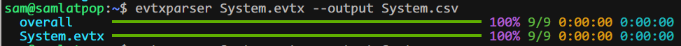

<p>
  <a href="https://github.com/samatild/evtxparser" target="_blank" rel="noopener">
    <i class="fab fa-github" aria-hidden="true"></i> GitHub
  </a>
  &nbsp;•&nbsp;
  <a href="https://pypi.org/project/evtxparser/" target="_blank" rel="noopener">
    <i class="fab fa-python" aria-hidden="true"></i> PyPI
  </a>
</p>


<i class="fas fa-file-alt" aria-hidden="true"></i> Export Windows Event Viewer `.evtx` logs to clean CSV output without dragging a GUI into the workflow.



## What is evtxparser?

[`evtxparser`](https://github.com/samatild/evtxparser) is a focused Python CLI for exporting Windows `.evtx` files to CSV. It is designed for the cases where you do not want a full GUI workflow or a heavyweight parsing pipeline: open the log, stream records, and write rows immediately.

That makes it useful for responders, administrators, and analysts who need to:

- Parse large Event Viewer files quickly
- Export records into a format that works well with spreadsheets, SQL, and quick scripts
- Keep a stable schema across runs instead of discovering columns on the fly
- Process one file or a full directory of logs with the same tool

## Why this tool is useful

Windows event logs are rich, but they are not always convenient to work with in bulk. Native viewers are fine for ad hoc inspection, but they become awkward when you want to:

- Compare multiple hosts
- Filter records with shell tools or Python notebooks
- Feed event data into a data pipeline
- Archive a normalized export for later review

`evtxparser` solves that by producing a predictable CSV with the most useful system fields already broken out, while keeping event payloads compact instead of exploding them into thousands of dynamic columns.

## Installation

Install from PyPI:

```bash
pip install evtxparser
```

If you want optional parser and JSON speedups:

```bash
pip install "evtxparser[speedups]"
```

For local development:

```bash
git clone https://github.com/samatild/evtxparser.git
cd evtxparser
python -m pip install -e ".[dev,speedups]"
```

## Quick start

Export a single EVTX file to standard output:

```bash
evtxparser Security.evtx
```

Write the export to a CSV file:

```bash
evtxparser Security.evtx --output security.csv
```

Walk a directory recursively and combine logs into one CSV:

```bash
evtxparser /mnt/logs --recursive --output logs.csv
```

Keep the original XML for maximum fidelity:

```bash
evtxparser Security.evtx --include-xml --output security.csv
```

Use multiple worker processes for larger exports:

```bash
evtxparser Security.evtx --output security.csv --workers 8
```

## Output schema highlights

The export includes stable columns for the fields you usually care about first, including:

- `source_file`
- `record_number`
- `timestamp`
- `event_id`
- `channel`
- `provider_name`
- `computer`
- `user_id`
- `process_id`
- `thread_id`
- `activity_id`
- `related_activity_id`

For the payload itself, `evtxparser` keeps two especially practical columns:

- `event_data` stores ordered `EventData` items as compact JSON
- `user_data` stores `UserData` payloads as compact XML

That design matters because Windows events are messy in the real world. Some records repeat keys, some fields are unnamed, and some providers vary their payload structure between events. Preserving the ordered payload without flattening everything into dynamic columns keeps exports smaller, faster, and more reliable.

## Why it performs well

The project is built around a simple idea: do not build a giant in-memory object model if the end goal is a CSV file.

Its fast path is based on a few practical decisions:

- Memory-map the EVTX source file
- Process one record at a time
- Write rows immediately instead of staging a large intermediate structure
- Use a fixed CSV header instead of a schema inference pass
- Keep event-specific payloads in compact columns rather than generating a variable-width table

For bigger datasets, `--workers` lets the tool use multiple processes while preserving CSV row order.

## Good use cases

`evtxparser` fits well when you need repeatable exports from Windows logs, especially in situations such as:

- Incident response and triage
- Security investigations
- Host-to-host event comparison
- Preparing event logs for grep, pandas, SQLite, or Excel
- Building lightweight ingestion pipelines from archived `.evtx` files

## A practical example

A common workflow is to export `Security.evtx`, filter on a handful of event IDs, and then pivot or enrich the data elsewhere:

```bash
evtxparser Security.evtx --output security.csv
```

From there you can:

- Search for login-related event IDs
- Group by computer or provider
- Join the CSV with other evidence sources
- Keep `raw_xml` for the records that need deeper inspection

That is usually much faster than re-opening Event Viewer again and again for the same dataset.

## Related reading

- [Windows Administration](/windows/admin/) for the growing collection of Windows tooling and workflows
- [Linux Performance — Field Playbook](/linux/admin/linux-performance-playbook/) for a similar task-first troubleshooting style on Linux
- [Documentation Home](/) to browse more tools and operational guides

## Closing thoughts

`evtxparser` is opinionated in the right way: it focuses on one job, keeps the output stable, and avoids unnecessary complexity. If your workflow starts with `.evtx` files and ends with analysis in CSV-friendly tooling, it is a solid fit.

## Source

- Project: [`github.com/samatild/evtxparser`](https://github.com/samatild/evtxparser)
- Package: [PyPI](https://pypi.org/project/evtxparser/)
- Releases: [GitHub Releases](https://github.com/samatild/evtxparser/releases)